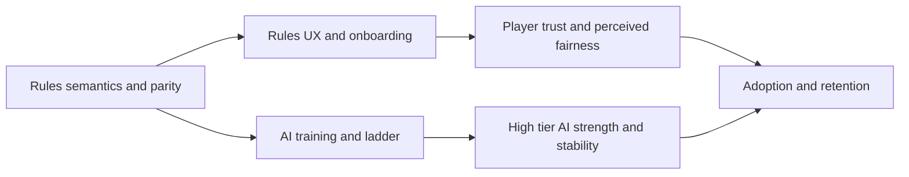

# RingRift Weakest Aspect and Hardest Problem Assessment Report

> **Doc status (2025-12-05): Canonical snapshot.**  
> This report synthesises prior architecture, rules, UX, and AI assessments into a single answer to the original question: _what is RingRift's single weakest aspect, and what is its single hardest outstanding problem?_ It is intended to be readable on its own, without the surrounding orchestration history.

## 1. Purpose and scope

This report has four goals:

- Summarise the current state of the RingRift project at a high level, based on [`CURRENT_STATE_ASSESSMENT.md`](CURRENT_STATE_ASSESSMENT.md:1), [`IMPROVEMENT_PLAN.md`](IMPROVEMENT_PLAN.md:1), and [`STRATEGIC_ROADMAP.md`](STRATEGIC_ROADMAP.md:1).
- Identify **one weakest aspect** of the system as it exists today, and explain why this aspect is weaker than other plausible candidates.
- Identify **one hardest outstanding problem**, distinct from the weakest aspect, and explain why it is structurally difficult.
- Connect these judgments to concrete remediation plans, specs, scripts, and tests so future work can iterate from a stable baseline.

**Definitions used in this report:**

- **Weakest aspect** – the area where the project is most fragile **relative to its own current strengths**, especially as experienced by players and new developers.
- **Hardest outstanding problem** – the technical or research problem that will be **most challenging to solve to a high standard**, even given the current architecture and tooling.

This document does **not** redefine goals, rules semantics, or SLOs. For those, defer to [`PROJECT_GOALS.md`](PROJECT_GOALS.md:1), [`RULES_CANONICAL_SPEC.md`](RULES_CANONICAL_SPEC.md:1), and [`STRATEGIC_ROADMAP.md`](STRATEGIC_ROADMAP.md:1). Instead, this report is a judgement layer over the existing artefacts.

---

## 2. Executive summary

As of December 2025, RingRift is a **stable beta** with a consolidated cross-language rules engine, mature backend and observability stack, and a fully wired AI ladder infrastructure. The project health in [`CURRENT_STATE_ASSESSMENT.md`](CURRENT_STATE_ASSESSMENT.md:39) is correctly described as **GREEN**.

Within that generally strong picture, two focal points stand out:

1. **Weakest aspect – Rules UX and onboarding.**
   - The rules semantics are well-specified and well-implemented (see [`RULES_CANONICAL_SPEC.md`](RULES_CANONICAL_SPEC.md:1), [`ringrift_complete_rules.md`](ringrift_complete_rules.md:1), [`RULES_ENGINE_ARCHITECTURE.md`](RULES_ENGINE_ARCHITECTURE.md:1), and [`FINAL_RULES_AUDIT_REPORT.md`](archive/FINAL_RULES_AUDIT_REPORT.md:1)).
   - However, the **player-facing explanations, HUD copy, weird-state UX, and teaching flows lag behind the engine**. Historical audits describe this as the “False Interface” problem: the UI used to say something different from what the engine and rules actually do (chain captures, victory thresholds, ANM/FE, stalemates, mini-regions).
   - Dedicated rules-UX specs and implementations now exist (telemetry, weird-state mapping, teaching scenarios, hotspot analysis), but they are at the start of a long-term improvement loop rather than a finished system.

2. **Hardest outstanding problem – Advanced AI strength and a stable high-tier ladder.**
   - The AI service is functionally solid (Random, Heuristic, Minimax, MCTS, Descent) and fully integrated across backend and client, with production-ready training infrastructure and gating tooling (see [`AI_ARCHITECTURE.md`](AI_ARCHITECTURE.md:1), [`AI_TRAINING_PLAN.md`](ai-service/docs/AI_TRAINING_PLAN.md:1), [`AI_TIER_TRAINING_AND_PROMOTION_PIPELINE.md`](docs/ai/AI_TIER_TRAINING_AND_PROMOTION_PIPELINE.md:1), and [`AI_DIFFICULTY_CALIBRATION_ANALYSIS.md`](docs/ai/AI_DIFFICULTY_CALIBRATION_ANALYSIS.md:1)).
   - But RingRift is **intrinsically AI-hard**, with extreme branching factors, discontinuous outcomes, strong non-locality, and designed-for-3+ player dynamics (see [`AI_DIFFICULTY_ANALYSIS.md`](docs/ai/AI_DIFFICULTY_ANALYSIS.md:1)). Building and maintaining truly strong, well-calibrated high-tier bots (D6–D10) that respect performance budgets and feel correct to humans is a long-term research problem, not a one-wave engineering task.

These two focal points are **deliberately distinct**:

- Rules UX and onboarding are the weakest aspect because they remain the **primary bottleneck for perceived fairness and trust** even after extensive remediation; most player complaints about “bugs” are still rooted in explanation gaps around ANM/FE, structural stalemates, and territory.
- Advanced AI strength and ladder stability are the hardest problem because they combine **model/search complexity, compute cost, data hygiene, and human calibration** in a single, high-dimensional loop where progress is slow and expensive, even with good tooling.

The remediation strategy is therefore two-pronged:

- Treat rules UX and onboarding as a **continuous improvement program**, driven by telemetry and iteration documents, until the player-facing layer is as reliable as the engine.
- Treat advanced AI strength and ladder stability as an **R&D track** with explicit pipelines, promotion gates, and calibration analyses, accepting that it will remain the longest-running frontier problem in the project.

---

## 3. Current architecture and workstreams (brief)

This section recaps the major subsystems at a high level. It is intentionally summary-only; deeper details live in the linked documents and code.

### 3.1 Rules engines

- **Shared TypeScript engine** – The canonical executable rules implementation lives under [`shared.engine`](src/shared/engine/index.ts:1), which exposes the orchestrator, helpers, and types shared by backend and client.
- **Python rules engine** – The AI service mirrors the rules semantics in [`python.rules.core`](ai-service/app/rules/core.py:1) and related modules, used for self-play, training, and AI evaluation.
- **Canonical rules specs** – Rules semantics are defined by:
  - [`RULES_CANONICAL_SPEC.md`](RULES_CANONICAL_SPEC.md:1) – normative canonical spec (RR‑CANON).
  - [`ringrift_complete_rules.md`](ringrift_complete_rules.md:1) and [`ringrift_compact_rules.md`](ringrift_compact_rules.md:1) – full rulebook and compact implementation summary.
- **Traceability and audits** – Rule-to-code mapping and verification live in [`RULES_ENGINE_ARCHITECTURE.md`](RULES_ENGINE_ARCHITECTURE.md:1), `docs/rules/*`, [`RULES_CONSISTENCY_EDGE_CASES.md`](docs/supplementary/RULES_CONSISTENCY_EDGE_CASES.md:1), and the final audit in [`FINAL_RULES_AUDIT_REPORT.md`](archive/FINAL_RULES_AUDIT_REPORT.md:1).

### 3.2 Backend and infrastructure

- **HTTP and WebSocket server** – The Node backend entry point [`server.index.ts`](src/server/index.ts:1) hosts REST APIs and WebSocket game sessions, with the WebSocket game host in [`websocket.server.ts`](src/server/websocket/server.ts:1).
- **Session management and persistence** – `GameSessionManager`, Prisma migrations, and Redis-backed caching manage game state and ratings, documented in [`OPERATIONS_DB.md`](docs/operations/OPERATIONS_DB.md:1).
- **Observability and alerting** – Prometheus metrics and Grafana dashboards are governed by [`ALERTING_THRESHOLDS.md`](docs/operations/ALERTING_THRESHOLDS.md:1) and the deployment and performance requirements in [`DEPLOYMENT_REQUIREMENTS.md`](docs/planning/DEPLOYMENT_REQUIREMENTS.md:1) and [`LOAD_TEST_BASELINE_REPORT.md`](docs/testing/LOAD_TEST_BASELINE_REPORT.md:1).

### 3.3 Client and UX

- **Application shell and routing** – The React SPA is rooted at [`client.App`](src/client/App.tsx:1), which wires routing, layout, and providers.
- **Core game HUD and victory flows** – The main HUD and game-end experiences are implemented in [`GameHUD.tsx`](src/client/components/GameHUD.tsx:1) and [`VictoryModal.tsx`](src/client/components/VictoryModal.tsx:1), with mobile and spectator variants layered on top.
- **Teaching and onboarding surfaces** – The contextual TeachingOverlay lives in [`TeachingOverlay.tsx`](src/client/components/TeachingOverlay.tsx:1), driven by curated teaching metadata in [`teachingScenarios.ts`](src/shared/teaching/teachingScenarios.ts:1). The sandbox host [`SandboxGameHost.tsx`](src/client/pages/SandboxGameHost.tsx:1) provides a local rules-complete environment with presets, self-play browser, and replay tooling.

### 3.4 AI service and training

- **Service entrypoint** – The Python FastAPI service entry is [`python.main`](ai-service/app/main.py:1), exposing `/ai/move` and related endpoints, and mapping difficulty numbers to AI engine configurations.
- **Training environment** – Training runs use [`python.TrainingEnvConfig`](ai-service/app/training/env.py:171) and [`python.RingRiftEnv`](ai-service/app/training/env.py:274) to construct canonical environments per board type and player count.
- **Training and evaluation code** – Core training and evaluation harnesses live in [`python.train`](ai-service/app/training/train.py:1) and [`python.tier_eval_runner`](ai-service/app/training/tier_eval_runner.py:1), with higher-level orchestration scripts under `ai-service/scripts/`.

### 3.5 Documentation and audits

- **Architecture** – System and engine design are documented in [`RULES_ENGINE_ARCHITECTURE.md`](RULES_ENGINE_ARCHITECTURE.md:1) and [`AI_ARCHITECTURE.md`](AI_ARCHITECTURE.md:1).
- **Rules and UX audits** – The final rules audit is captured in [`FINAL_RULES_AUDIT_REPORT.md`](archive/FINAL_RULES_AUDIT_REPORT.md:1). Documentation and rules-UX issues are catalogued in [`RULES_DOCS_UX_AUDIT.md`](docs/supplementary/RULES_DOCS_UX_AUDIT.md:1).
- **AI service assessment** – Historical AI host analysis, gaps, and recommendations are recorded in [`AI_ASSESSMENT_REPORT.md`](ai-service/AI_ASSESSMENT_REPORT.md:1).

These artefacts collectively show a **strong core**: rules semantics are correct and well-tested; backend and infra are production-ready; the AI service is technically sophisticated; and documentation coverage is broad. Against that background, the weakest aspect and hardest problem both live at the **interface between this solid core and human perception/skill**.

---

## 4. Weakest aspect – Rules UX and onboarding

### 4.1 Why rules UX is the weakest aspect

The rules UX and onboarding layer is the weakest aspect of RingRift for three interlocking reasons:

1. **Historical “False Interface” gaps.**  
   The final rules audit in [`FINAL_RULES_AUDIT_REPORT.md`](archive/FINAL_RULES_AUDIT_REPORT.md:100) and the documentation UX audit in [`RULES_DOCS_UX_AUDIT.md`](docs/supplementary/RULES_DOCS_UX_AUDIT.md:15) both highlight that:
   - HUD copy used to directly contradict RR‑CANON: chain captures described as “continue or end your turn” when RR‑CANON‑R103 makes continuation mandatory; victory modal describing elimination as “all rings” when the true threshold is “>50% of total rings”.
   - The public rulebook [`ringrift_complete_rules.md`](ringrift_complete_rules.md:1) lagged behind the canonical spec on key details such as the unified landing rule and forced elimination FAQ answers.
   - These mismatches made the **UI less trustworthy than the engine**, damaging perceived fairness even when the underlying rules implementation was correct.

2. **Intrinsic difficulty of explaining ANM/FE, stalemates, and mini-regions.**
   - **Active‑No‑Moves and Forced Elimination (ANM/FE):** Players experience turns where “I have pieces, but no moves, and my caps just disappear”. The canonical descriptions in [`RULES_CANONICAL_SPEC.md`](RULES_CANONICAL_SPEC.md:210) and behavioural catalogue in [`ACTIVE_NO_MOVES_BEHAVIOUR.md`](docs/ACTIVE_NO_MOVES_BEHAVIOUR.md:1) are correct but conceptually dense.
   - **Structural stalemates:** Global plateaus resolved by territory → rings → markers → last actor (RR‑CANON‑R173) involve a multi-step tiebreak ladder that is non‑obvious unless carefully explained.
   - **Territory mini‑regions and self‑elimination:** Mini-region archetypes (FAQ Q23) and territory helpers tested in [`RulesMatrix.Territory.MiniRegion.test.ts`](tests/scenarios/RulesMatrix.Territory.MiniRegion.test.ts:19) require understanding both region geometry and the “outside stack pays the cost” self‑elimination rule.
   - These mechanics are **essential to RingRift’s identity**, but are harder to communicate than conventional capture or area-control rules in other games.

3. **High impact on perceived correctness and fairness.**
   - When ANM/FE, stalemate, or mini-region behaviour is not explained well, players almost always interpret it as a **bug or unfair ruling**, because the observed outcome (caps disappear, game ends abruptly, territory collapses) is far from everyday intuition.
   - Even with correct implementation, **perception is dominated by surface copy and teaching flows**. If those are unclear, players doubt the entire ruleset and, by extension, the project.

The net effect is that **rules UX is still the primary bottleneck on player trust**, even after significant fixes. The underlying rules semantics, engine parity, and tests are all in good shape; the weakest aspect is how that complexity is surfaced and taught.

### 4.2 Comparison with other candidate weak points

Several other areas were plausible candidates for “weakest aspect” and are worth comparing explicitly:

- **Core rules implementation and parity.**
  - Status: Strong. The cross-language rules implementation is tightly validated: 54+ contract vectors, replay parity harnesses, strict invariants, and extensive scenario tests (see [`CURRENT_STATE_ASSESSMENT.md`](CURRENT_STATE_ASSESSMENT.md:107) and the rule-level matrix in [`FINAL_RULES_AUDIT_REPORT.md`](archive/FINAL_RULES_AUDIT_REPORT.md:172)).
  - Remaining gaps (e.g. explicit Last‑Player‑Standing R172 handling, some property-based territory invariants) are well-bounded and documented in [`RULES_CONSISTENCY_EDGE_CASES.md`](docs/supplementary/RULES_CONSISTENCY_EDGE_CASES.md:1), not project-defining weaknesses.

- **Backend infrastructure and production hardening.**
  - Status: Strong and improving. PASS20–21 remediation plus [`IMPROVEMENT_PLAN.md`](IMPROVEMENT_PLAN.md:61) and [`STRATEGIC_ROADMAP.md`](STRATEGIC_ROADMAP.md:185) describe mature CI, WebSocket infrastructure, k6 load tests, Grafana dashboards, and go/no‑go checklists.
  - Remaining work (scale tests, recurring ops drills) are important but incremental; they are not the primary bottleneck to player trust or feature velocity.

- **Frontend UX beyond rules explanations.**
  - Status: Medium‑strong. The HUD, lobby, mobile layouts, accessibility features, and spectator tools are all significantly improved (see Wave 8 and Wave 14 sections in [`IMPROVEMENT_PLAN.md`](IMPROVEMENT_PLAN.md:332)).
  - There is still polish work to do, but **general UX quality is no longer the weakest aspect**; the remaining pain is concentrated in explaining the rules, not in basic UI affordances.

- **AI service robustness and observability.**
  - Status: Good. The AI service has strong metrics, strict invariants, and parity tooling (see [`AI_ASSESSMENT_REPORT.md`](ai-service/AI_ASSESSMENT_REPORT.md:21) and ai-service docs). The main open issues are about strength calibration, not correctness or uptime.

In contrast, rules UX and onboarding:

- Sit directly on the critical path for **every new player**.
- Are still catching up to the correctness and observability of the underlying engine.
- Have an explicit historical record as the “weakest link” in [`FINAL_RULES_AUDIT_REPORT.md`](archive/FINAL_RULES_AUDIT_REPORT.md:102) and [`RULES_DOCS_UX_AUDIT.md`](docs/supplementary/RULES_DOCS_UX_AUDIT.md:15).

For these reasons, **rules UX and onboarding remain the single weakest aspect of the project**, even though substantial remediation work has already been completed.

---

## 5. Hardest problem – Advanced AI strength and stable high-tier ladder

### 5.1 Why advanced AI strength is the hardest problem

Building and maintaining strong, stable high-tier AI opponents (D6–D10) for RingRift is the hardest outstanding problem for structural reasons:

1. **Inherent game complexity.**  
   [`AI_DIFFICULTY_ANALYSIS.md`](docs/ai/AI_DIFFICULTY_ANALYSIS.md:1) concludes that RingRift is plausibly **harder for AI than Go, Chess, Hex, or Arimaa**, due to:
   - Enormous state space (stacked pieces, markers, collapsed spaces, multi-colour stacks).
   - Pathologically high branching factors, especially from chain captures with hundreds of thousands of valid continuations in realistic midgames.
   - Long tactical horizons and discontinuous outcomes (lines, region collapses, forced elimination cascades).
   - Strong non‑locality (territory and connectivity depend on global marker layouts).
   - Designed multi‑player (3–4 players) dynamics with coalition and non‑zero‑sum payoffs.
     These are **structural properties of the game**, not implementation flaws; any AI strong enough to be satisfying at the top of the ladder must cope with them.

2. **Multi-factor constraints beyond pure strength.**  
   Strong AI for RingRift must be:
   - **Accurate** – obeying canonical rules and parity with the TS engine on complex edge cases.
   - **Fast enough** – respecting per-tier performance budgets (p95 latency, average move times) defined in [`AI_TIER_PERF_BUDGETS.md`](docs/ai/AI_TIER_PERF_BUDGETS.md:1) and enforced by perf harnesses.
   - **Stable across tiers** – maintaining a clear ordering D2 < D4 < D6 < D8 in both automated evaluation and human perception (see [`AI_TIER_TRAINING_AND_PROMOTION_PIPELINE.md`](docs/ai/AI_TIER_TRAINING_AND_PROMOTION_PIPELINE.md:39)).
   - **Calibrated to humans** – mapping difficulty numbers to perceived challenge for different skill bands, using calibration telemetry and experiments as described in [`AI_DIFFICULTY_CALIBRATION_ANALYSIS.md`](docs/ai/AI_DIFFICULTY_CALIBRATION_ANALYSIS.md:28).
     Optimising all four dimensions simultaneously is much harder than simply “make the bot stronger”.

3. **R&D-heavy feedback loops.**
   - Training pipelines (self‑play, dataset generation, NN training) in [`python.train`](ai-service/app/training/train.py:1) and the orchestration script [`run_tier_training_pipeline.py`](ai-service/scripts/run_tier_training_pipeline.py:1) produce candidate models that must then be:
     - Evaluated in tournaments and tier evals via [`python.tier_eval_runner`](ai-service/app/training/tier_eval_runner.py:1) and [`run_tier_gate.py`](ai-service/scripts/run_tier_gate.py:1).
     - Gated against perf budgets via [`run_tier_perf_benchmark.py`](ai-service/scripts/run_tier_perf_benchmark.py:1) or the combined wrapper [`run_full_tier_gating.py`](ai-service/scripts/run_full_tier_gating.py:1).
     - Registered and tracked in the tier candidate registry [`tier_candidate_registry.square8_2p.json`](ai-service/config/tier_candidate_registry.square8_2p.json:1) and helpers in [`tier_promotion_registry.py`](ai-service/app/training/tier_promotion_registry.py:1).
     - Analysed post‑hoc via calibration analysis scripts such as [`analyze_difficulty_calibration.py`](ai-service/scripts/analyze_difficulty_calibration.py:1) and tests like [`test_analyze_difficulty_calibration.py`](ai-service/tests/test_analyze_difficulty_calibration.py:1).
   - Each loop requires substantial compute, human time, and careful interpretation; progress is measured in **waves of experiments**, not quick patches.

4. **Long-lived uncertainty and research risk.**
   - Unlike rules implementation or backend infra, there is no known off‑the‑shelf architecture guaranteed to produce super‑strong RingRift AI on commodity hardware; [`AI_DIFFICULTY_ANALYSIS.md`](docs/ai/AI_DIFFICULTY_ANALYSIS.md:219) explicitly notes that standard AlphaZero‑style techniques face serious obstacles.
   - Future improvements are likely to involve hybrid symbolic/neural methods, specialised chain‑capture reasoning, and tailored evaluation functions – all of which require experimentation and may fail partially before converging.

For these reasons, **advanced AI strength and a stable high‑tier ladder are the hardest problem**, even though the scaffolding (service, training env, gating and perf harnesses, calibration analysis) is now well-defined.

### 5.2 Distinction from the weakest aspect

It is important to keep the hardest problem conceptually distinct from the weakest aspect:

- Rules UX is weak **because the game is already hard and subtle**, and human-facing explanations lag behind the engine.
- AI strength is hard **because the game is hard for machines**, and pushing the top tiers into “truly strong” territory requires sustained research under technical and operational constraints.
- Improving rules UX primarily involves **communication, UX design, and targeted implementation**; the underlying rules semantics and telemetry stack are already robust.
- Improving AI strength primarily involves **algorithmic innovation, training data curation, and large‑scale evaluation**, even though the hosting and monitoring infrastructure is already in place.

In other words:

- The weakest aspect is **how humans understand the rules**.
- The hardest problem is **how machines master the rules**.

Neither fully subsumes the other; they share inputs (rules semantics, parity, and training data hygiene) but diverge sharply in difficulty profile.

---

## 6. Remediation plan for the weakest aspect (rules UX and onboarding)

This section summarises the rules‑UX remediation plan and its implementation status. Detailed contracts live in the dedicated UX specs:

- Telemetry – [`UX_RULES_TELEMETRY_SPEC.md`](docs/UX_RULES_TELEMETRY_SPEC.md:1).
- Weird states (ANM/FE, stalemate, LPS) – [`UX_RULES_WEIRD_STATES_SPEC.md`](docs/UX_RULES_WEIRD_STATES_SPEC.md:1).
- Teaching scenarios – [`UX_RULES_TEACHING_SCENARIOS.md`](docs/UX_RULES_TEACHING_SCENARIOS.md:1).
- Improvement loop and iteration structure – [`UX_RULES_IMPROVEMENT_LOOP.md`](docs/UX_RULES_IMPROVEMENT_LOOP.md:1) and the first concrete iteration [`UX_RULES_IMPROVEMENT_ITERATION_0001.md`](docs/ux/rules_iterations/UX_RULES_IMPROVEMENT_ITERATION_0001.md:1).

### 6.1 Telemetry and hotspot analysis

Telemetry for rules UX is defined and partially implemented as follows:

- **Shared event types and envelope** – [`rulesUxEvents.ts`](src/shared/telemetry/rulesUxEvents.ts:1) defines a `RulesUxEvent` payload and enums for event types, rules contexts, and sources, matching the schema in [`UX_RULES_TELEMETRY_SPEC.md`](docs/UX_RULES_TELEMETRY_SPEC.md:34).
- **Client helper** – [`rulesUxTelemetry.ts`](src/client/utils/rulesUxTelemetry.ts:1) provides a small API for emitting rules‑UX events from HUD, VictoryModal, TeachingOverlay, sandbox, and FAQ surfaces.
- **Server ingestion route** – [`rulesUxTelemetry.ts`](src/server/routes/rulesUxTelemetry.ts:1) accepts batched events, validates them, and increments low‑cardinality Prometheus counters such as `ringrift_rules_ux_events_total` as described in the spec.
- **Hotspot taxonomy** – [`rulesUxHotspotTypes.ts`](src/shared/telemetry/rulesUxHotspotTypes.ts:1) defines derived “hotspot” categories and metrics surfaces (help opens per 100 games, resigns after weird states, rapid reopen rates).
- **Analysis script and tests** – [`analyze_rules_ux_telemetry.ts`](scripts/analyze_rules_ux_telemetry.ts:1) implements W‑UX‑1 hotspot queries over exported metrics, and [`RulesUxHotspotAnalysis.test.ts`](tests/unit/RulesUxHotspotAnalysis.test.ts:1) exercises the core aggregation logic.

Together, these pieces make it possible to **quantitatively identify** which rules contexts (ANM/FE, structural stalemate, mini‑regions, capture chains, etc.) generate the most confusion, rather than guessing from anecdotes.

### 6.2 Weird‑state UX for ANM/FE, stalemates, and LPS

Weird and complex rules outcomes now have a dedicated taxonomy and UX mapping:

- [`UX_RULES_WEIRD_STATES_SPEC.md`](docs/UX_RULES_WEIRD_STATES_SPEC.md:1) defines:
  - Stable **reason codes** (e.g. `ANM_MOVEMENT_FE_BLOCKED`, `STRUCTURAL_STALEMATE_TIEBREAK`, `LAST_PLAYER_STANDING_EXCLUSIVE_REAL_ACTIONS`).
  - Canonical copy blocks for HUD banners, VictoryModal explanations, and TeachingOverlay topics.
  - Mappings from reason codes to telemetry `rules_context` values such as `anm_forced_elimination`, `structural_stalemate`, and `last_player_standing`.
- The client HUD and victory flows are wired to these mappings via:
  - Phase and weird‑state banners in [`GameHUD.tsx`](src/client/components/GameHUD.tsx:1), which now distinguish normal phases from ANM/FE and stalemate situations.
  - Victory explanations in [`VictoryModal.tsx`](src/client/components/VictoryModal.tsx:1), which use reason codes and doc anchors from the spec to explain structural stalemates and FE‑heavy outcomes.
- Telemetry for weird states uses `weird_state_type` labels (`active-no-moves-movement`, `forced-elimination`, `structural-stalemate`, etc.) as described in both [`UX_RULES_TELEMETRY_SPEC.md`](docs/UX_RULES_TELEMETRY_SPEC.md:332) and [`UX_RULES_WEIRD_STATES_SPEC.md`](docs/UX_RULES_WEIRD_STATES_SPEC.md:468).

This mapping converts previously opaque, surprising endings into **named, explainable states** that can be:

- Recognised by HUD and VictoryModal.
- Routed into appropriate teaching flows.
- Measured via telemetry for impact on resigns and help usage.

### 6.3 Teaching flows and sandbox integration

Teaching flows turn high‑confusion rules contexts into curated scenarios and guided explanations:

- [`UX_RULES_TEACHING_SCENARIOS.md`](docs/UX_RULES_TEACHING_SCENARIOS.md:33) defines scenario families such as:
  - `fe_loop_intro` – Forced elimination loops and ANM.
  - `mini_region_intro` – Territory mini‑regions and self‑elimination (Q23 archetype).
  - `structural_stalemate_intro` – Plateau endings and tiebreak ladders.
  - `last_player_standing_intro` – Differentiating Last‑Player‑Standing from stalemate.
- Concrete teaching metadata is implemented in [`teachingScenarios.ts`](src/shared/teaching/teachingScenarios.ts:1) and rendered by [`TeachingOverlay.tsx`](src/client/components/TeachingOverlay.tsx:1), with integration into:
  - Sandbox presets and the “Rules clinic” tab in [`SandboxGameHost.tsx`](src/client/pages/SandboxGameHost.tsx:1).
  - Contextual entrypoints from HUD and VictoryModal (e.g. “What happened?” links for FE loops and structural stalemates).
- Sandbox teaching telemetry is captured via [`sandboxRulesUxTelemetry.ts`](src/client/sandbox/sandboxRulesUxTelemetry.ts:1), emitting `sandbox_scenario_loaded`, `sandbox_scenario_completed`, and `teaching_step_*` events tagged with `rulesConcept`.

These flows provide a **positive path** for confused players: from a weird HUD banner or surprising victory explanation directly into worked examples that match the canonical rules.

### 6.4 Iteration loop and iteration 0001

Rules‑UX work is explicitly structured as a recurring iteration loop:

- [`UX_RULES_IMPROVEMENT_LOOP.md`](docs/UX_RULES_IMPROVEMENT_LOOP.md:1) defines:
  - A 4‑week cadence for iterations.
  - Standard hotspot queries (help opens per 100 games, rapid reopen fractions, resigns after weird states).
  - A lightweight iteration template under `docs/ux/rules_iterations/`.
- [`UX_RULES_IMPROVEMENT_ITERATION_0001.md`](docs/ux/rules_iterations/UX_RULES_IMPROVEMENT_ITERATION_0001.md:1) applies this loop to:
  - `anm_forced_elimination` (ANM/FE loops).
  - `structural_stalemate` (plateau endings).
  - `territory_mini_region` (Q23 mini‑regions).
    and defines concrete planned adjustments for banners, explanations, and teaching flows.

This turns the weakest aspect into a **managed, telemetry‑driven program** rather than a grab‑bag of one‑off fixes.

### 6.5 Completed RX and remaining work

As of this report:

- The most severe copy mismatches identified in [`RULES_DOCS_UX_AUDIT.md`](docs/supplementary/RULES_DOCS_UX_AUDIT.md:31) (chain capture, victory thresholds, line rewards, territory self‑elimination) are fixed in HUD and VictoryModal.
- Weird‑state reason codes are defined and partially wired, with clear contracts for future work.
- Teaching flows for ANM/FE, structural stalemate, and mini‑regions are specified and partially integrated into TeachingOverlay and sandbox.
- Telemetry is defined and partially implemented; analysis scripts and tests exist.

Remaining work is **iterative rather than foundational**:

- Expanding coverage of weird‑state mappings (e.g. Last‑Player‑Standing once implemented explicitly).
- Filling out teaching flows, diagrams, and sandbox scenarios.
- Running multiple W‑UX iterations and publishing iteration notes under `docs/ux/rules_iterations/`.
- Using hotspot analysis to prioritise copy and scenario work for the highest‑impact rules contexts.

In summary, the weakest aspect is no longer “unaddressed”, but it **remains weaker than the rest of the system** and requires sustained attention across future releases.

---

## 7. Remediation plan for the hardest problem (AI ladder and advanced strength)

The AI ladder remediation story has three layers:

1. **Architecture and training infrastructure.**
2. **Tier training, gating, and perf budgets.**
3. **Human calibration and ladder tuning.**

### 7.1 Architecture and training infrastructure

Core AI service and training infrastructure are documented and implemented as follows:

- **Service architecture** – [`AI_ARCHITECTURE.md`](AI_ARCHITECTURE.md:1) describes the FastAPI service, AI agents (Random, Heuristic, Minimax, MCTS, Descent, Neural), and integration points with the main backend.
- **Training plans and datasets** – [`AI_TRAINING_PLAN.md`](ai-service/docs/AI_TRAINING_PLAN.md:1) and [`AI_TRAINING_AND_DATASETS.md`](docs/ai/AI_TRAINING_AND_DATASETS.md:1) specify how self‑play, territory datasets, and evaluation pools are generated and consumed.
- **Game record and replay infrastructure** – GameRecord schemas and replay tooling in `ai-service` and the main repo support training, evaluation, and golden replays, as summarised in [`IMPROVEMENT_PLAN.md`](IMPROVEMENT_PLAN.md:568) Wave 10 and 11 sections.
- **Parity and invariants** – Python `GameEngine` behaviour, strict invariant soaks, and replay parity tooling are covered in [`AI_ASSESSMENT_REPORT.md`](ai-service/AI_ASSESSMENT_REPORT.md:21) and rules parity docs.

These pieces ensure that **training and evaluation run on canonical rules**, with consistent game records and reusable datasets.

### 7.2 Tier training, gating, and perf budgets

The core of the ladder remediation is the **tiered training and promotion pipeline** for Square‑8 2‑player tiers D2, D4, D6, and D8:

- [`AI_TIER_TRAINING_AND_PROMOTION_PIPELINE.md`](docs/ai/AI_TIER_TRAINING_AND_PROMOTION_PIPELINE.md:1) defines:
  - The training and evaluation pipeline per tier (D2 heuristic, D4/D6 minimax or NN‑backed search, D8 MCTS).
  - Tier invariants (ordering, non‑regression vs previous models, perf budgets).
  - Concrete CLI entrypoints for training (`run_tier_training_pipeline.py`), evaluation and gating (`run_tier_gate.py`), and combined gating + perf checks (`run_full_tier_gating.py`).
- Performance budgets per tier are specified in [`AI_TIER_PERF_BUDGETS.md`](docs/ai/AI_TIER_PERF_BUDGETS.md:1) and enforced by the benchmark harness [`python.tier_perf_benchmark`](ai-service/app/training/tier_perf_benchmark.py:1) via the CLI [`run_tier_perf_benchmark.py`](ai-service/scripts/run_tier_perf_benchmark.py:1) or the combined wrapper [`run_full_tier_gating.py`](ai-service/scripts/run_full_tier_gating.py:1).
- The tier candidate registry [`tier_candidate_registry.square8_2p.json`](ai-service/config/tier_candidate_registry.square8_2p.json:1) and helpers in [`tier_promotion_registry.py`](ai-service/app/training/tier_promotion_registry.py:1) track:
  - Current ladder assignments per tier.
  - Candidate models, their training runs, gate reports, perf results, and promotion decisions.
  - Historical promotions and rollbacks for auditability.
- Cross‑tier and cross‑model evaluation harnesses (`run_ai_tournament.py`, `evaluate_ai_models.py`, `run_parity_promotion_gate.py`) support richer comparisons when needed.

Together, these tools support a **repeatable, evidence‑based ladder improvement loop**:

1. Train candidate model for tier T via [`run_tier_training_pipeline.py`](ai-service/scripts/run_tier_training_pipeline.py:1).
2. Gate candidate vs baselines and previous tier via [`run_full_tier_gating.py`](ai-service/scripts/run_full_tier_gating.py:1).
3. If both difficulty gate and perf budgets pass, record promotion plans and update the registry via [`apply_tier_promotion_plan.py`](ai-service/scripts/apply_tier_promotion_plan.py:1) in a controlled Code‑mode change.

### 7.3 Human calibration and ladder tuning

Automated gates alone are not sufficient; human calibration and perceived difficulty must also be measured and fed back:

- [`AI_HUMAN_CALIBRATION_GUIDE.md`](docs/ai/AI_HUMAN_CALIBRATION_GUIDE.md:1) defines calibration templates (A/B/C) across player segments (new, intermediate, strong) and target win‑rate bands per tier.
- Difficulty calibration telemetry is wired via:
  - Shared payload definitions in [`difficultyCalibrationEvents.ts`](src/shared/telemetry/difficultyCalibrationEvents.ts:1).
  - Client helper [`difficultyCalibrationTelemetry.ts`](src/client/utils/difficultyCalibrationTelemetry.ts:1).
  - Server route [`difficultyCalibrationTelemetry.ts`](src/server/routes/difficultyCalibrationTelemetry.ts:1).
  - Metrics sink [`MetricsService.recordDifficultyCalibrationEvent`](src/server/services/MetricsService.ts:1292), which emits `ringrift_difficulty_calibration_events_total`.
- [`AI_DIFFICULTY_CALIBRATION_ANALYSIS.md`](docs/ai/AI_DIFFICULTY_CALIBRATION_ANALYSIS.md:1) specifies:
  - How to aggregate calibration telemetry into per‑tier, per‑segment metrics (win rates, perceived difficulty distributions, tail fractions).
  - How to join those metrics with gating/perf results and the candidate registry.
  - Decision rules for identifying tiers that are too easy, too hard, or within the desired band.
- The analysis script [`analyze_difficulty_calibration.py`](ai-service/scripts/analyze_difficulty_calibration.py:1) and its tests [`test_analyze_difficulty_calibration.py`](ai-service/tests/test_analyze_difficulty_calibration.py:1) are the concrete tooling for generating calibration reports and, in future, CI signals.

This yields a **closed loop**:

- Training and automated gates ensure **objective strength and performance compliance**.
- Calibration telemetry and analysis ensure **subjective alignment with human expectations**.
- The tier registry ties both together into a durable history of ladder decisions.

### 7.4 Scope and remaining difficulty

Even with all this scaffolding, several hard problems remain:

- Scaling strong AI beyond Square‑8 2‑player to larger boards and multi‑player modes without blowing perf budgets.
- Designing and training neural architectures that can handle chain capture combinatorics, non‑local territory reasoning, and multi‑player dynamics.
- Gathering enough high‑quality human calibration data across tiers to make confident, statistically robust tuning decisions.
- Evolving the ladder and difficulty descriptors as human skill distributions shift over time.

In other words, **the infrastructure for solving the hardest problem is now in place**, but the problem itself remains difficult and will likely dominate AI‑related work for multiple future waves.

---

## 8. Recommendations and next steps

This section frames concrete recommendations for future work, organised by weakest aspect and hardest problem.

### 8.1 Rules UX and onboarding

Near‑term recommendations:

- **Operationalise W‑UX iterations.**
  - Treat [`UX_RULES_IMPROVEMENT_LOOP.md`](docs/UX_RULES_IMPROVEMENT_LOOP.md:1) and [`UX_RULES_IMPROVEMENT_ITERATION_0001.md`](docs/ux/rules_iterations/UX_RULES_IMPROVEMENT_ITERATION_0001.md:1) as the canonical process.
  - Schedule at least one rules‑UX iteration per major release until telemetry shows ANM/FE, structural stalemate, and mini‑regions are no longer top confusion hotspots.

- **Use telemetry to prioritise.**
  - Run [`analyze_rules_ux_telemetry.ts`](scripts/analyze_rules_ux_telemetry.ts:1) regularly to compute:
    - Help opens per 100 games by `rules_concept`.
    - Rapid help reopen fractions.
    - Resigns after weird states per `rules_context`.
  - Prioritise copy and teaching work for the highest‑impact contexts.

- **Tighten weird‑state UX routing.**
  - Ensure that every weird‑state banner and VictoryModal explanation:
    - Uses a stable reason code from [`UX_RULES_WEIRD_STATES_SPEC.md`](docs/UX_RULES_WEIRD_STATES_SPEC.md:1).
    - Offers a “What happened?” link that opens the appropriate TeachingOverlay flow from [`UX_RULES_TEACHING_SCENARIOS.md`](docs/UX_RULES_TEACHING_SCENARIOS.md:1).
  - Add regression tests around this routing where they are currently missing.

- **Document and advertise the rules‑UX system.**
  - Keep [`RULES_DOCS_UX_AUDIT.md`](docs/supplementary/RULES_DOCS_UX_AUDIT.md:1) updated to reflect closed items and new findings.
  - Add a short “Rules UX system” section to player‑facing docs or site copy pointing to TeachingOverlay, sandbox presets, and FAQ integration so players know where to look for help.

Medium‑term recommendations:

- Expand teaching flows beyond ANM/FE, stalemate, and mini‑regions to cover:
  - Capture chains and mandatory continuation in more depth.
  - Line vs territory ordering in complex midgame turns.
  - Multi‑player specific concepts (e.g. kingmaking, threat assessment).
- Integrate UX findings with AI calibration, e.g. correlating rules confusion with specific board types, tiers, or matchup patterns.

### 8.2 AI ladder and advanced strength

Near‑term recommendations:

- **Exercise the full training and gating loop for at least one tier.**
  - Run a complete cycle of [`run_tier_training_pipeline.py`](ai-service/scripts/run_tier_training_pipeline.py:1) → [`run_full_tier_gating.py`](ai-service/scripts/run_full_tier_gating.py:1) → [`apply_tier_promotion_plan.py`](ai-service/scripts/apply_tier_promotion_plan.py:1) for a Square‑8 2‑player tier (likely D4 or D6) and record the outcome in the tier registry.
  - Use this as a template for future, more frequent cycles.

- **Establish a regular calibration cadence.**
  - Schedule periodic calibration windows and automate generation of calibration reports via [`analyze_difficulty_calibration.py`](ai-service/scripts/analyze_difficulty_calibration.py:1).
  - Store human‑readable reports under `docs/ai/calibration_runs/` as specified in [`AI_DIFFICULTY_CALIBRATION_ANALYSIS.md`](docs/ai/AI_DIFFICULTY_CALIBRATION_ANALYSIS.md:1).

- **Close the loop between calibration and ladder changes.**
  - Use calibration analyses to:
    - Flag tiers that are clearly too easy or too hard for their intended player segments.
    - Drive decisions about which tiers to re‑train, which to remap in UX, and where to adjust search budgets within perf constraints.

Medium‑term recommendations:

- Extend the full training and gating pipeline from Square‑8 2‑player to:
  - Larger square boards (19×19).
  - Hex boards.
  - Multi‑player configurations (3–4 players).
- Experiment with more advanced architectures and search techniques tailored to RingRift’s structure (e.g. state factorizations for chain captures, specialised connectivity evaluators).
- Use golden replays and curated high‑skill human games as additional evaluation benchmarks for top-tier AI behaviour.

---

## 9. How to use this report

This report is intended to be the **canonical written answer** to the original assessment question about RingRift’s weakest aspect and hardest problem. Future work should treat it as:

- The **top‑level narrative** for why rules UX and onboarding are still the weakest aspect, and why advanced AI strength and ladder stability are the hardest problem.
- A **map of supporting artefacts**:
  - Rules semantics and engine audits → [`RULES_CANONICAL_SPEC.md`](RULES_CANONICAL_SPEC.md:1), [`ringrift_complete_rules.md`](ringrift_complete_rules.md:1), [`RULES_ENGINE_ARCHITECTURE.md`](RULES_ENGINE_ARCHITECTURE.md:1), [`FINAL_RULES_AUDIT_REPORT.md`](archive/FINAL_RULES_AUDIT_REPORT.md:1).
  - Rules‑UX system → [`RULES_DOCS_UX_AUDIT.md`](docs/supplementary/RULES_DOCS_UX_AUDIT.md:1), [`UX_RULES_TELEMETRY_SPEC.md`](docs/UX_RULES_TELEMETRY_SPEC.md:1), [`UX_RULES_WEIRD_STATES_SPEC.md`](docs/UX_RULES_WEIRD_STATES_SPEC.md:1), [`UX_RULES_TEACHING_SCENARIOS.md`](docs/UX_RULES_TEACHING_SCENARIOS.md:1), [`UX_RULES_IMPROVEMENT_LOOP.md`](docs/UX_RULES_IMPROVEMENT_LOOP.md:1).
  - AI ladder and calibration system → [`AI_TIER_TRAINING_AND_PROMOTION_PIPELINE.md`](docs/ai/AI_TIER_TRAINING_AND_PROMOTION_PIPELINE.md:1), [`AI_TIER_PERF_BUDGETS.md`](docs/ai/AI_TIER_PERF_BUDGETS.md:1), [`AI_DIFFICULTY_CALIBRATION_ANALYSIS.md`](docs/ai/AI_DIFFICULTY_CALIBRATION_ANALYSIS.md:1), [`AI_DIFFICULTY_ANALYSIS.md`](docs/ai/AI_DIFFICULTY_ANALYSIS.md:1), [`AI_ASSESSMENT_REPORT.md`](ai-service/AI_ASSESSMENT_REPORT.md:1).
- A **snapshot** for future improvement waves:
  - Later passes should be able to say “relative to the 2025‑12 snapshot, rules UX is now stronger/weaker, and AI ladder issues have evolved as follows”.

As of this report, the project’s story is:

- The **rules are correct and well‑implemented**, but explaining them remains the weakest aspect.
- The **AI infrastructure is strong and well‑instrumented**, but pushing top-tier strength and stability remains the hardest problem.
- Both areas now have clear specs, tools, and processes; what remains is focused, sustained execution over multiple future waves.
