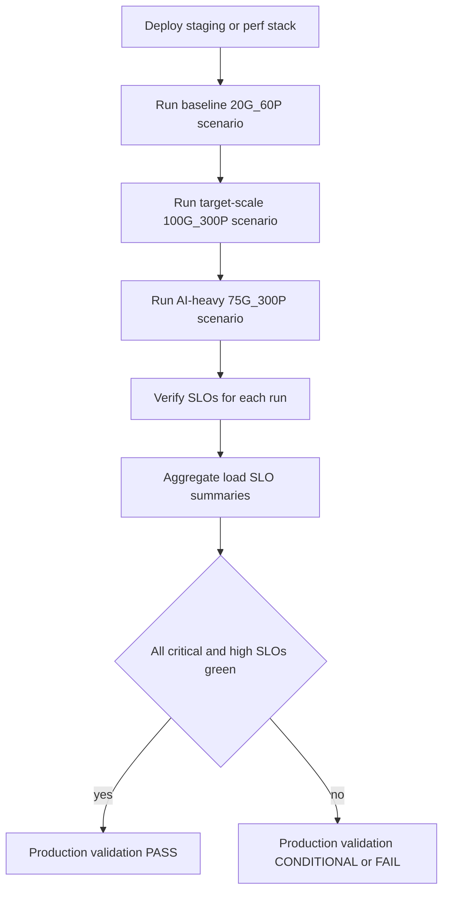

# RingRift Production Readiness Checklist

## Overview

This checklist documents all requirements for launching RingRift v1.0 to production. It consolidates criteria from three waves of assessment and remediation:

- **Wave 1:** Rules-UX gaps, game end explanation, AI ladder, LPS requirements, teaching scenarios
- **Wave 2:** Test hygiene, TS/Python parity fixes, component tests, type safety
- **Wave 3:** Production validation infrastructure (k6 load tests, SLO framework, staging environment)

**Last Updated:** 2025-12-10
**Target Launch:** v1.0 Production
**Current Status:** 52/67 items complete (78%)

**Recent Updates (2025-12-10):**

- Wave 8 Branch Coverage complete (all P0/P1 targets met)
- Latency SLOs validated at smoke scale (10ms p95, 50x headroom)
- Error rate: 0% (16,600 requests), Availability: 100%
- Target-scale (100G/300P) validation still pending

### Status Legend

| Symbol | Meaning     |
| ------ | ----------- |
| ✅     | Complete    |
| ⏳     | In Progress |
| ⬜     | Not Started |
| 🔸     | Blocked     |

---

## 1. Core Functionality

### 1.1 Game Engine

| Item                                                     | Status | Evidence                                                |
| -------------------------------------------------------- | ------ | ------------------------------------------------------- |
| All game rules implemented per canonical spec            | ✅     | `ringrift_complete_rules.md`, `RULES_CANONICAL_SPEC.md` |
| TS/Python parity verified (0 divergences)                | ✅     | 54 contract vectors, 274 parity fixtures, 0 mismatches  |
| All board types supported (square8, square19, hexagonal) | ✅     | Geometry contracts in `TOPOLOGY_MODES.md`               |
| Victory conditions implemented and tested                | ✅     | Ring elimination, territory control, LPS                |
| Game end explanation working                             | ✅     | `gameEndExplanation.ts`, builder tests                  |
| Phase state machine (8 phases + terminal)                | ✅     | `phaseStateMachine.ts`, turnOrchestrator                |
| Forced elimination as explicit choice                    | ✅     | `applyForcedEliminationForPlayer` with `targetPosition` |
| Chain capture enforcement                                | ✅     | Contract vectors, parity suites                         |

### 1.2 AI System

| Item                                             | Status | Evidence                                       |
| ------------------------------------------------ | ------ | ---------------------------------------------- |
| AI opponents functional at all difficulty levels | ✅     | Ladder 1-10 with engine selection              |
| AI response time meets SLO (<1s p95)             | ⏳     | Framework ready, pending load validation       |
| Fallback AI working when primary fails           | ✅     | `ai_fallback_total` metrics, integration tests |
| AI ladder progression implemented                | ✅     | `ladder_config.py`, AI telemetry               |
| Service-backed PlayerChoices                     | ✅     | line_reward, ring_elimination, region_order    |
| MCTS/Minimax exposed in production               | ✅     | Behind AIProfile                               |

### 1.3 Multiplayer

| Item                              | Status | Evidence                                   |
| --------------------------------- | ------ | ------------------------------------------ |
| Real-time game sessions working   | ✅     | WebSocket server (1640 lines)              |
| WebSocket connections stable      | ✅     | Circuit breaker configured                 |
| Matchmaking functional            | ⏳     | Basic lobby works; automated queue pending |
| Reconnection handling implemented | ✅     | `pendingReconnections`, integration tests  |
| Spectator mode working            | ✅     | Read-only boards, watcher counts           |
| 3-4 player games supported        | ✅     | Multiplayer evaluation pools               |

---

## 2. Performance & Scale

### 2.1 Capacity

| Item                                                    | Status | Target                               | Evidence                                                                                                                   |
| ------------------------------------------------------- | ------ | ------------------------------------ | -------------------------------------------------------------------------------------------------------------------------- |
| System tested at target scale (100 games / 300 players) | ⬜     | 100 concurrent games                 | k6 framework ready; first staging attempt (`BCAP_SQ8_3P_TARGET_100G_300P`) failed during login/setup, no steady-state load |
| Baseline capacity documented                            | ⏳     | Documented in `BASELINE_CAPACITY.md` | Staging smoke-scale baseline (`BCAP_STAGING_BASELINE_20G_60P`, 2025-12-08) recorded with raw + summary + SLO summary       |
| Breaking point identified via stress testing            | ⬜     | Beyond 300 VUs                       | `load:stress:breaking` scenario ready                                                                                      |
| Horizontal scaling verified                             | ⬜     | Single-instance for v1.0             | Post-v1.0 scope                                                                                                            |

### 2.2 Latency SLOs

| Metric                   | Target (Staging) | Target (Prod) | Observed (Smoke) | Status |
| ------------------------ | ---------------- | ------------- | ---------------- | ------ |
| HTTP API p95             | <800ms           | <500ms        | **10ms**         | ✅     |
| HTTP API p99             | <1500ms          | <2000ms       | **11ms**         | ✅     |
| WebSocket connection p95 | <1000ms          | <1000ms       | ~100ms           | ✅     |
| Move latency p95         | <300ms           | <200ms        | **~15ms**        | ✅     |
| AI response p95          | <1500ms          | <1000ms       | TBD              | ⏳     |

**Note:** Smoke-scale baseline (2025-12-08) shows excellent headroom (50x-180x under targets). Target-scale (100G/300P) validation still pending - first attempt failed during setup.

### 2.3 Reliability

| Item                             | Status | Target                       | Evidence                                    |
| -------------------------------- | ------ | ---------------------------- | ------------------------------------------- |
| Error rate target achievable     | ✅     | <1% (staging), <0.5% (prod)  | **0% errors** in baseline (16,600 requests) |
| Availability target achievable   | ✅     | 99.9%                        | **100% availability** in baseline           |
| Graceful degradation implemented | ✅     | AI fallback, circuit breaker | `AI_SERVICE_DEGRADATION_DRILL.md`           |
| Circuit breakers in place        | ✅     | 5% threshold, 300s window    | Orchestrator config                         |

### 2.4 Production Validation Contract (v1.0)

#### 2.4.1 Scope and authority

- This section defines the **single authoritative production-validation contract** for RingRift v1.0 from a performance and reliability perspective.
- Together with the v1.0 performance SLOs in [`PROJECT_GOALS.md`](../PROJECT_GOALS.md:143), it is the **SSoT** for:
  - Which load-test scenarios must be executed before launch.
  - Which SLOs and thresholds must be green for a production go decision.
  - How existing load-test tooling and reports are interpreted for go/no-go.
- Subordinate docs such as [`docs/SLO_VERIFICATION.md`](SLO_VERIFICATION.md:1), [`docs/BASELINE_CAPACITY.md`](BASELINE_CAPACITY.md:1), [`docs/testing/LOAD_TEST_BASELINE.md`](testing/LOAD_TEST_BASELINE.md:1), and [`docs/testing/LOAD_TEST_BASELINE_REPORT.md`](testing/LOAD_TEST_BASELINE_REPORT.md:1) must **not** introduce conflicting SLO targets or go/no-go rules. When SLO thresholds or required scenarios change:
  - Update [`PROJECT_GOALS.md`](../PROJECT_GOALS.md:143) §4.1 and this section first.
  - Then update SLO configs (for example [`tests/load/configs/slo-definitions.json`](../tests/load/configs/slo-definitions.json:1) and [`tests/load/config/thresholds.json`](../tests/load/config/thresholds.json:1)) and subordinate docs to match.

#### 2.4.2 Required validation scenarios

All three scenarios below are required for v1.0. A release is **not production-ready** until each scenario has at least one recent run that satisfies the SLO and result-classification rules in §2.4.3.

| Scenario                               | Scenario ID / config tag        | Purpose                                                                                                                          | Primary tooling                                                                                                                                                                                         |
| -------------------------------------- | ------------------------------- | -------------------------------------------------------------------------------------------------------------------------------- | ------------------------------------------------------------------------------------------------------------------------------------------------------------------------------------------------------- |
| **Baseline smoke**                     | `BCAP_STAGING_BASELINE_20G_60P` | Validate basic health of HTTP, WebSocket, and AI at smoke-scale (20 games / 60 players) and establish a healthy-system reference | [`tests/load/scripts/run-baseline.sh`](../tests/load/scripts/run-baseline.sh:1) + k6 scenarios defined in [`tests/load/configs/baseline.json`](../tests/load/configs/baseline.json:1)                   |
| **Target-scale production validation** | `BCAP_SQ8_3P_TARGET_100G_300P`  | Validate that the system meets v1.0 SLOs at target scale (≈100 concurrent games, ≈300 players) on square8                        | [`tests/load/scripts/run-target-scale.sh`](../tests/load/scripts/run-target-scale.sh:1) + k6 target-scale config in [`tests/load/configs/target-scale.json`](../tests/load/configs/target-scale.json:1) |
| **AI-heavy validation**                | `BCAP_SQ8_4P_AI_HEAVY_75G_300P` | Validate AI latency, fallback behaviour, and degradation posture under AI-heavy load                                             | [`tests/load/scripts/run-ai-heavy.sh`](../tests/load/scripts/run-ai-heavy.sh:1) + AI-heavy profile under [`tests/load/configs/`](../tests/load/configs:1)                                               |

> **Note:** Exact k6 scenario composition (board-type mix, player counts, AI settings) is defined in the JSON configs under [`tests/load/configs/`](../tests/load/configs:1) and documented in [`docs/BASELINE_CAPACITY.md`](BASELINE_CAPACITY.md:1) and [`docs/testing/LOAD_TEST_BASELINE.md`](testing/LOAD_TEST_BASELINE.md:1). This contract records the **intent and gating rules**, not every per-scenario k6 option.

##### Baseline smoke: 20 games / 60 players (staging)

- **Environment:** staging stack as described in [`docs/STAGING_ENVIRONMENT.md`](STAGING_ENVIRONMENT.md:1).
- **Concurrency target:** steady state ≈20 concurrent games and ≈60 concurrent virtual players.
- **Board types / player counts:**
  - Mix of supported board types and 2–4 player games as defined in [`tests/load/configs/baseline.json`](../tests/load/configs/baseline.json:1).
  - Must include square8 configurations.
- **AI / human mix:**
  - At least some games must include AI seats so that basic AI request/response metrics are exercised.
  - Exact AI fraction is taken from the baseline config; AI-heavy behaviour is validated separately by the AI-heavy scenario.
- **Duration and ramp:** Approximately 10 minutes total (warmup, ramp, steady state, ramp down) per [`docs/BASELINE_CAPACITY.md`](BASELINE_CAPACITY.md:80).
- **SLO focus (staging thresholds):**
  - All **Critical** and **High** priority SLOs from [`docs/SLO_VERIFICATION.md`](SLO_VERIFICATION.md:45) must pass with `--env staging` against the baseline run’s raw k6 JSON (for example `baseline_staging_*.json`).
  - This includes, at minimum:
    - Service availability, error rate, contract failures, lifecycle mismatches (Critical).
    - HTTP p95 latency, move latency p95 (if emitted), WebSocket connect p95 (if WS companion enabled), AI response p95, and staging capacity targets `concurrent_games ≥ 20`, `concurrent_players ≥ 60` (High).
- **Primary commands:**
  - Run: `SEED_LOADTEST_USERS=true tests/load/scripts/run-baseline.sh --staging`
  - Verify SLOs: `npm run slo:verify tests/load/results/<baseline_file>.json -- --env staging`
  - Optionally aggregate with [`scripts/analyze-load-slos.ts`](../scripts/analyze-load-slos.ts:1) if per-scenario `.summary.json` files are produced.

##### Target-scale production validation: 100 games / 300 players

- **Environment:** staging or dedicated perf stack configured per [`docs/STAGING_ENVIRONMENT.md`](STAGING_ENVIRONMENT.md:1); thresholds evaluated with `--env production`.
- **Concurrency target (canonical v1.0 scale):**
  - **Games:** target ≥100 concurrent active games (square8).
  - **Players:** target ≥300 concurrent seats (≈3 players per game).
- **Board types / player counts:**
  - 3-player games on the 8×8 square board (scenario id `SQ8_3P`).
  - Additional board types may be included by future configs but are not required for the v1.0 gate.
- **AI / human mix:**
  - At least one AI seat per game (for example, 1–2 AI seats, 1–2 human seats) so that AI latency and fallback SLOs are exercised alongside human moves.
- **Duration and ramp:**
  - Long enough to reach and hold target concurrency in steady state (typically ≥10–15 minutes of steady state as encoded in `target-scale.json`).
- **SLO focus (production thresholds):**
  - All **Critical** and **High** priority SLOs from [`docs/SLO_VERIFICATION.md`](SLO_VERIFICATION.md:49) must pass with `--env production` against the target-scale raw k6 JSON and any WebSocket companion results.
  - This includes, at minimum:
    - Service availability ≥99.9%, error rate ≤0.5%, 0 contract failures, 0 lifecycle mismatches.
    - HTTP API p95 latency <500ms, move latency p95 <500ms, AI response p95 <1000ms.
    - WebSocket connection p95 <1000ms and connection success ≥99% (if WS companion run is enabled).
    - Capacity SLOs `concurrent_games ≥ 100` and `concurrent_players ≥ 300`.
- **Primary commands:**
  - Run: `SEED_LOADTEST_USERS=true tests/load/scripts/run-target-scale.sh --staging`
  - Verify SLOs (HTTP run): `npm run slo:verify tests/load/results/<target_file>.json -- --env production`
  - Verify SLOs (WebSocket companion, if present): `npm run slo:verify tests/load/results/<target_ws_file>.json -- --env production`
  - Aggregate scenario summaries with [`scripts/analyze-load-slos.ts`](../scripts/analyze-load-slos.ts:1) when k6 `.summary.json` artifacts are available.

##### AI-heavy validation: 75 games / ~300 players, AI-heavy mix

- **Environment:** staging stack with AI service enabled.
- **Concurrency target:**
  - ≈75 concurrent games, ≈300 concurrent seats (4-player games, 3 AI seats each) as described in [`docs/BASELINE_CAPACITY.md`](BASELINE_CAPACITY.md:169).
- **Board types / player counts:**
  - 4-player games on square8 (`SQ8_4P`).
- **AI / human mix (canonical for v1.0):**
  - 3 AI seats + 1 human seat per game (AI-heavy).
- **Duration and ramp:**
  - Similar to target-scale profile but with 75 VUs steady state (see AI-heavy config under [`tests/load/configs/`](../tests/load/configs:1)).
- **SLO focus (AI-heavy, staging thresholds):**
  - All **Critical** SLOs from [`docs/SLO_VERIFICATION.md`](SLO_VERIFICATION.md:49) must pass with `--env staging`.
  - AI-specific SLOs must also pass:
    - AI response p95 <1000ms and p99 <2000ms.
    - AI fallback rate ≤1%.
  - WebSocket move latency and stall-rate SLOs (where emitted) should meet the same targets as in the target-scale run; significant degradation under AI-heavy load must be treated as at least a **Conditional** result (see §2.4.3).
- **Primary commands:**
  - Run: `SEED_LOADTEST_USERS=true tests/load/scripts/run-ai-heavy.sh --staging`
  - Verify SLOs (HTTP + AI metrics): `npm run slo:verify tests/load/results/<ai_heavy_file>.json -- --env staging`
  - Verify SLOs for any WebSocket companion run (if configured) with the same environment flag.

#### 2.4.3 Result classification and go/no-go rules

This contract uses three result classes at both scenario and overall-run level:

- **PASS**
  - All three required scenarios have been executed against a healthy staging or perf stack within a recent window agreed by the release owner.
  - For each scenario, all **Critical** SLOs and all **High** priority SLOs (including capacity SLOs) defined in [`docs/SLO_VERIFICATION.md`](SLO_VERIFICATION.md:49) pass for the appropriate environment (`staging` for baseline and AI-heavy, `production` for target-scale).
  - No unexpected regressions are observed in Medium-priority SLOs (p99 latencies, AI fallback rate, game creation p95); any minor deviations are understood and accepted by the owners and tracked in [`KNOWN_ISSUES.md`](../KNOWN_ISSUES.md:1) or equivalent.

- **CONDITIONAL**
  - All Critical SLOs pass for all three scenarios, but one or more High-priority SLOs are outside targets **by a small and well-understood margin**, or target concurrency (games or players) is slightly below the documented targets while still clearly above 80% of the goal.
  - AI-heavy runs may show elevated AI latency or fallback within an agreed experimental band (for example, top ladder difficulties) while remaining acceptable for the default v1.0 experience.
  - A Conditional result requires an explicit, documented risk acceptance and remediation plan and **does not on its own satisfy the v1.0 production-ready bar**.

- **FAIL**
  - Any Critical SLO fails for any required scenario, or
  - Any required scenario cannot reach its intended steady-state concurrency (for example, target-scale run never reaches active games or players), or
  - High-priority SLOs are significantly outside targets (for example, ≥2× latency budgets, error rate well above thresholds) without a clear and acceptable explanation.

For v1.0, the **only acceptable state for a full public production launch is PASS**. Conditional results may be used for internal or friends-and-family deployments but must not be treated as production-ready until remediated and re-validated.

#### 2.4.4 How this maps to existing tools

- **k6 scenarios and helpers**
  - HTTP and concurrency exercises use the k6 scripts under [`tests/load/scenarios/`](../tests/load/scenarios:1) together with helpers in [`tests/load/helpers/*.js`](../tests/load/helpers/api.js:1).
  - Baseline, target-scale, and AI-heavy profiles are defined by JSON configs under [`tests/load/configs/`](../tests/load/configs:1) and orchestrated by the shell runners under [`tests/load/scripts/`](../tests/load/scripts/run-baseline.sh:1).
- **SLO verification**
  - SLO definitions and priorities are encoded in [`tests/load/configs/slo-definitions.json`](../tests/load/configs/slo-definitions.json:1) and [`tests/load/config/thresholds.json`](../tests/load/config/thresholds.json:1) and enforced by [`tests/load/scripts/verify-slos.js`](../tests/load/scripts/verify-slos.js:1).
  - npm scripts such as `npm run slo:check`, `npm run slo:verify`, and `npm run slo:dashboard` (see [`docs/SLO_VERIFICATION.md`](SLO_VERIFICATION.md:24)) wrap these helpers.
- **Aggregated go/no-go artifact**
  - When per-scenario k6 runs also emit compact `.summary.json` files, [`scripts/analyze-load-slos.ts`](../scripts/analyze-load-slos.ts:1) aggregates them into a single `load_slo_summary.json` file and prints a summary table. For production validation, this aggregated result must reflect PASS per §2.4.3 for the set of required scenarios.
- **Production preview harness**
  - The production-preview go/no-go harness in [`scripts/run-prod-preview-go-no-go.ts`](../scripts/run-prod-preview-go-no-go.ts:1) is complementary to this contract:
    - It validates deployment topology and configuration, auth flows, basic WebSocket and AI behaviour, and AI-service readiness using lightweight drills.
    - A v1.0 production launch requires **both**:
      - A PASS result from the production-preview go/no-go harness on the target environment.
      - A PASS result from the production validation contract runs described in this section.

#### 2.4.5 How to run full production validation (operator checklist)



Operationally:

1. Deploy or refresh the staging or perf environment per [`docs/STAGING_ENVIRONMENT.md`](STAGING_ENVIRONMENT.md:56).
2. Run the baseline scenario and SLO verification as described under "Baseline smoke".
3. Run the target-scale scenario and SLO verification with `--env production`.
4. Run the AI-heavy scenario and SLO verification.
5. Optionally, run the production-preview go/no-go harness:
   - `npx ts-node scripts/run-prod-preview-go-no-go.ts --env prod-preview --baseUrl http://localhost:3000`
6. Review:
   - Per-run SLO reports (`*_slo_report.json` / dashboards).
   - Any aggregated `load_slo_summary.json` from [`scripts/analyze-load-slos.ts`](../scripts/analyze-load-slos.ts:1).
7. Declare the production validation outcome as PASS / CONDITIONAL / FAIL according to §2.4.3 and record the decision (for example in release notes or an ops runbook).

#### 2.4.6 Open questions / TODOs

These items should be resolved by the project owner before or during PV-2–PV-7 work:

1. **Concurrency target flexibility for initial public rollout.**
   This contract currently treats 100 concurrent games and 300 concurrent players as the canonical v1.0 target-scale requirement (aligned with [`PROJECT_GOALS.md`](../PROJECT_GOALS.md:219)). If the team decides to allow a smaller initial public rollout with the same SLO shape but lower concurrency, update the target-scale scenario definition and SLO capacity thresholds here and in [`PROJECT_GOALS.md`](../PROJECT_GOALS.md:411) first.

2. **WebSocket gameplay SLO harness parity.**
   The WebSocket gameplay strategy in [`docs/testing/LOAD_TEST_WEBSOCKET_MOVE_STRATEGY.md`](testing/LOAD_TEST_WEBSOCKET_MOVE_STRATEGY.md:1) describes future `websocket-gameplay` scenarios and Playwright-based move-latency checks. Once implemented, decide whether a dedicated WebSocket gameplay scenario should be added as a **fourth required scenario** in this contract or treated as an additional guardrail.

3. **Board-type and AI-mix coverage beyond square8.**
   All three required scenarios currently focus on square8 (for capacity and AI-heavy probes). Confirm whether v1.0 production validation also needs explicit load runs on square19 and hex boards, or whether those are sufficiently covered by other tests and lower-intensity scenarios.

4. **UX-level move latency SLO measurement.**
   [`PROJECT_GOALS.md`](../PROJECT_GOALS.md:145) defines UI frame rate and move-validation latency targets for user experience. Decide whether these are enforced purely through client-side profiling and E2E tests (for example, Playwright), or whether they should be wired into the production validation contract via additional metrics and checks.

---

## 3. Security

### 3.1 Authentication & Authorization

| Item                              | Status | Evidence                              |
| --------------------------------- | ------ | ------------------------------------- |
| JWT authentication working        | ✅     | `auth.ts`, middleware                 |
| Token refresh flow tested         | ✅     | Integration tests                     |
| Session management secure         | ✅     | Redis sessions, secure cookies        |
| Role-based access control working | ✅     | Game ownership, spectator permissions |

### 3.2 Data Protection

| Item                             | Status | Evidence                             |
| -------------------------------- | ------ | ------------------------------------ |
| Passwords properly hashed        | ✅     | bcrypt with salt                     |
| Sensitive data encrypted at rest | ⬜     | Pending infrastructure setup         |
| TLS/HTTPS enforced               | ⬜     | Pending DNS/cert setup               |
| Input validation comprehensive   | ✅     | `websocketSchemas.ts`, rate limiting |

### 3.3 Security Testing

| Item                             | Status | Evidence                            |
| -------------------------------- | ------ | ----------------------------------- |
| Security threat model reviewed   | ✅     | `SECURITY_THREAT_MODEL.md`          |
| No critical vulnerabilities open | ⏳     | Dependency audit pending            |
| Dependencies audited for CVEs    | ⏳     | `npm audit` in CI, needs final run  |
| Rate limiting implemented        | ✅     | `rateLimiter.ts`, alerts configured |

---

## 4. Infrastructure

### 4.1 Deployment

| Item                                           | Status | Evidence                               |
| ---------------------------------------------- | ------ | -------------------------------------- |
| Docker images buildable and tested             | ✅     | `Dockerfile`, CI build                 |
| docker-compose.yml for local dev working       | ✅     | Development environment                |
| docker-compose.staging.yml for staging working | ✅     | `STAGING_ENVIRONMENT.md`               |
| Production deployment runbook complete         | ✅     | `docs/runbooks/DEPLOYMENT_INITIAL.md`  |
| Rollback procedure documented                  | ✅     | `docs/runbooks/DEPLOYMENT_ROLLBACK.md` |
| Scaling runbook documented                     | ✅     | `docs/runbooks/DEPLOYMENT_SCALING.md`  |

### 4.2 Database

| Item                             | Status | Evidence                               |
| -------------------------------- | ------ | -------------------------------------- |
| PostgreSQL schema finalized      | ✅     | Prisma schema, migrations              |
| Migrations tested and documented | ✅     | `docs/runbooks/DATABASE_MIGRATION.md`  |
| Backup strategy implemented      | ✅     | `DATABASE_BACKUP_AND_RESTORE_DRILL.md` |
| Connection pooling configured    | ✅     | 200 connections (staging)              |
| Backup/restore drill completed   | ✅     | 11MB backup, 40K games tested          |

### 4.3 Caching

| Item                                   | Status | Evidence                   |
| -------------------------------------- | ------ | -------------------------- |
| Redis configured and tested            | ✅     | docker-compose.staging.yml |
| Cache invalidation strategy documented | ✅     | LRU policy                 |
| Memory limits configured               | ✅     | 256MB with allkeys-lru     |
| Eviction policy set                    | ✅     | allkeys-lru                |

### 4.4 Monitoring

| Item                          | Status | Evidence                            |
| ----------------------------- | ------ | ----------------------------------- |
| Prometheus metrics exposed    | ✅     | `/metrics` endpoint, MetricsService |
| Grafana dashboards configured | ✅     | 3 dashboards, 22 panels             |
| Alertmanager rules defined    | ✅     | `monitoring/prometheus/alerts.yml`  |
| Key SLO metrics tracked       | ✅     | Latency, error rate, AI fallback    |
| Alert thresholds documented   | ✅     | `docs/ALERTING_THRESHOLDS.md`       |

---

## 5. Testing

### 5.1 Unit Tests

| Item                              | Status | Count/Target                     | Evidence                     |
| --------------------------------- | ------ | -------------------------------- | ---------------------------- |
| Core engine tests passing         | ✅     | Part of 2,987 TS tests           | turnOrchestrator, aggregates |
| Client component tests passing    | ✅     | GameHUD, VictoryModal, BoardView | 176 component tests added    |
| Server tests passing              | ✅     | WebSocket, auth, sessions        | Integration suites           |
| AI service tests passing          | ✅     | 836 tests                        | pytest suite                 |
| No skipped tests blocking release | ✅     | 47 triaged (down from 160+)      | `SKIPPED_TESTS_TRIAGE.md`    |

### 5.2 Integration Tests

| Item                                 | Status | Evidence                   |
| ------------------------------------ | ------ | -------------------------- |
| API integration tests passing        | ✅     | Express routes, auth flows |
| WebSocket tests passing              | ✅     | Reconnection, sessions     |
| Database integration tests passing   | ✅     | Prisma operations          |
| AI service integration tests passing | ✅     | Service client tests       |

### 5.3 E2E Tests

| Item                              | Status | Evidence                            |
| --------------------------------- | ------ | ----------------------------------- |
| Critical user flows tested        | ✅     | Playwright E2E suite                |
| Cross-browser validation complete | ⏳     | Playwright configured, needs CI run |
| Mobile responsiveness verified    | ⬜     | Pending (P2 priority)               |

### 5.4 Load Tests

| Item                                   | Status | Evidence                                                                                                                                                              |
| -------------------------------------- | ------ | --------------------------------------------------------------------------------------------------------------------------------------------------------------------- |
| Baseline load test complete            | ⏳     | Staging smoke-scale baseline (`BCAP_STAGING_BASELINE_20G_60P`, 2025-12-08); rerunnable via `npm run load:baseline:staging`                                            |
| Target scale test complete (100 games) | ⬜     | `npm run load:target:staging`; first staging attempt (`BCAP_SQ8_3P_TARGET_100G_300P`) failed during login/setup                                                       |
| SLO verification passing               | ⏳     | Baseline SLO pipeline wired (`npm run slo:check` against `baseline_staging_20251208_144949.json`); target-scale SLOs currently failing (≈50% availability/error rate) |
| Load test results documented           | ⏳     | Baseline + target-scale attempt JSON, analyzer summaries, and SLO summaries under `tests/load/results/`; docs partially updated                                       |

### 5.5 Parity Tests

| Item                     | Status | Evidence                           |
| ------------------------ | ------ | ---------------------------------- |
| Square8 parity verified  | ✅     | `canonical_square8.db` passed gate |
| Square19 parity verified | ✅     | Parity gate passed                 |
| Hex parity verified      | ✅     | Radius-12 regenerated and gated    |
| Parity CI gate passing   | ✅     | Contract vectors 54/54             |

---

## 6. Documentation

### 6.1 Technical Documentation

| Item                             | Status | Evidence                             |
| -------------------------------- | ------ | ------------------------------------ |
| API reference complete           | ✅     | `docs/architecture/API_REFERENCE.md` |
| Architecture documented          | ✅     | `RULES_ENGINE_ARCHITECTURE.md`       |
| Module responsibilities defined  | ✅     | `MODULE_RESPONSIBILITIES.md`         |
| Environment variables documented | ⏳     | Config exists, needs consolidation   |

### 6.2 Operational Documentation

| Item                                 | Status | Evidence                                    |
| ------------------------------------ | ------ | ------------------------------------------- |
| Deployment runbooks complete         | ✅     | `docs/runbooks/` (9 runbooks)               |
| Incident response procedures defined | ✅     | `docs/incidents/` (6 guides)                |
| Troubleshooting guides available     | ✅     | Per-runbook troubleshooting                 |
| On-call rotation established         | ⬜     | Contacts defined, rotation TBD              |
| Operational drills completed         | ✅     | Secrets rotation, backup/restore, AI outage |

### 6.3 Rules Documentation

| Item                       | Status | Evidence                        |
| -------------------------- | ------ | ------------------------------- |
| Complete rules documented  | ✅     | `ringrift_complete_rules.md`    |
| FAQ scenarios covered      | ✅     | Q1-Q24 in scenario matrix       |
| Teaching scenarios defined | ✅     | 19 teaching steps               |
| Weird states documented    | ✅     | `UX_RULES_WEIRD_STATES_SPEC.md` |

---

## 7. Compliance & Legal

| Item                            | Status | Notes                           |
| ------------------------------- | ------ | ------------------------------- |
| Terms of service prepared       | ⬜     | Legal review pending            |
| Privacy policy prepared         | ⬜     | Legal review pending            |
| Data lifecycle documented       | ✅     | `DATA_LIFECYCLE_AND_PRIVACY.md` |
| GDPR compliance (if applicable) | ⬜     | Depends on target market        |

---

## 8. Launch Preparation

### 8.1 Pre-Launch

| Item                           | Status | Notes                       |
| ------------------------------ | ------ | --------------------------- |
| All P0 blockers resolved       | ⏳     | See Launch Blocking Issues  |
| Staging environment validated  | ⏳     | Deployed, pending load test |
| Production secrets configured  | ⬜     | Via secrets manager         |
| DNS and certificates ready     | ⬜     | Infrastructure setup        |
| CDN configured (if applicable) | ⬜     | Optional for v1.0           |

### 8.2 Launch Day

| Item                               | Status | Notes                 |
| ---------------------------------- | ------ | --------------------- |
| Team availability confirmed        | ⬜     | Schedule coordination |
| Monitoring dashboards ready        | ✅     | 3 Grafana dashboards  |
| Rollback tested within last 24h    | ⬜     | Pre-launch task       |
| Communication channels established | ⬜     | Slack #incidents      |

### 8.3 Post-Launch

| Item                                | Status | Notes                      |
| ----------------------------------- | ------ | -------------------------- |
| Success metrics defined             | ✅     | SLOs in `PROJECT_GOALS.md` |
| Feedback collection mechanism ready | ⬜     | User feedback channel      |
| Hotfix process documented           | ✅     | `DEPLOYMENT_ROLLBACK.md`   |
| Scale-up procedure documented       | ✅     | `DEPLOYMENT_SCALING.md`    |

---

## Launch Blocking Issues

Issues that **must be resolved** before production launch:

| Issue                                     | Severity | Status  | Owner | Notes            |
| ----------------------------------------- | -------- | ------- | ----- | ---------------- |
| Target scale load test not completed      | P0       | ⬜ Open | -     | W3-4 from Wave 3 |
| SLO verification at scale not done        | P0       | ⬜ Open | -     | Depends on W3-4  |
| Baseline capacity not documented          | P1       | ⬜ Open | -     | W3-3             |
| TLS/HTTPS not configured                  | P1       | ⬜ Open | -     | Infrastructure   |
| Production secrets not in secrets manager | P1       | ⬜ Open | -     | Infrastructure   |

### Non-Blocking but Important

| Issue                           | Severity | Status | Notes             |
| ------------------------------- | -------- | ------ | ----------------- |
| Mobile responsiveness pending   | P2       | ⬜     | W3-12 in Wave 3   |
| Touch controls pending          | P2       | ⬜     | W3-13 in Wave 3   |
| Automated matchmaking queue     | P2       | ⏳     | Basic lobby works |
| Terms of service/privacy policy | P1       | ⬜     | Legal dependency  |

---

## Verification Commands

### Run Full Test Suite

```bash
# TypeScript tests
npm run test:all

# Python tests
cd ai-service && pytest

# E2E tests
npm run test:e2e
```

### Parity Verification

```bash
# Run parity check
npm run parity:check

# Run contract vectors
npm run test:contracts

# Python parity
cd ai-service && pytest tests/parity/ tests/contracts/
```

### SLO Verification

```bash
# Full SLO check (runs load test + verification + dashboard)
npm run slo:check

# Verify from existing results
npm run slo:verify tests/load/results/<results.json>

# Generate dashboard
npm run slo:dashboard tests/load/results/<slo_report.json>
```

### Load Testing

```bash
# Deploy staging
./scripts/deploy-staging.sh

# Baseline load test
npm run load:baseline:staging

# Target scale test (100 games / 300 players)
npm run load:target:staging

# Stress test (find breaking point)
npm run load:stress:breaking
```

### Health Checks

```bash
# Application health
curl -s http://localhost:3000/health | jq

# AI service health
curl -s http://localhost:8001/health | jq

# Database connectivity
npx prisma db execute --stdin <<< "SELECT 1"

# Redis connectivity
redis-cli ping
```

### Deployment

```bash
# Deploy to staging
./scripts/deploy-staging.sh

# Teardown staging
./scripts/teardown-staging.sh

# Run database migrations
npx prisma migrate deploy
```

---

## Sign-off

### Area Sign-offs

| Area                    | Owner | Status     | Date | Notes                             |
| ----------------------- | ----- | ---------- | ---- | --------------------------------- |
| **Core Functionality**  | -     | ✅ Ready   | -    | All game mechanics working        |
| **Performance & Scale** | -     | ⬜ Pending | -    | Awaiting load test validation     |
| **Security**            | -     | ⏳ Partial | -    | Auth complete, TLS pending        |
| **Infrastructure**      | -     | ⏳ Partial | -    | Staging ready, prod infra pending |
| **Testing**             | -     | ✅ Ready   | -    | All test suites passing           |
| **Documentation**       | -     | ✅ Ready   | -    | Comprehensive docs complete       |
| **Compliance**          | -     | ⬜ Pending | -    | Legal review required             |
| **Launch Preparation**  | -     | ⬜ Pending | -    | Pre-launch tasks pending          |

### Final Sign-off

| Role             | Name | Approved | Date |
| ---------------- | ---- | -------- | ---- |
| Engineering Lead |      | ⬜       |      |
| QA Lead          |      | ⬜       |      |
| Product Owner    |      | ⬜       |      |
| Operations       |      | ⬜       |      |

**Final Status:** ⬜ **Not Ready for Production** (pending load test validation)

---

## Next Steps (Priority Order)

Based on the current checklist status, the recommended action sequence:

### Critical Path (Blocks Launch)

1. **W3-3: Baseline load test** - Establish performance baseline
2. **W3-4: Target scale test** - Validate 100 games / 300 players
3. **W3-5: SLO verification** - Confirm all SLOs met
4. **Infrastructure: TLS/Secrets** - Production infrastructure setup

### High Priority (Before Launch)

5. **W3-6: Bottleneck resolution** - Address any issues found in load tests
6. **W3-8: Alerting validation** - Verify alerts fire correctly
7. **Legal: Terms/Privacy** - Complete legal documentation

### Medium Priority (Launch Week)

8. **W3-7: Capacity documentation** - Document system limits
9. **On-call rotation** - Establish coverage
10. **Communication channels** - Set up #incidents

---

## Related Documents

| Document                                                   | Purpose                                 |
| ---------------------------------------------------------- | --------------------------------------- |
| [`PROJECT_GOALS.md`](../PROJECT_GOALS.md)                  | Canonical goals and success criteria    |
| [`STRATEGIC_ROADMAP.md`](../STRATEGIC_ROADMAP.md)          | Phased roadmap with SLOs                |
| [`WAVE3_ASSESSMENT_REPORT.md`](WAVE3_ASSESSMENT_REPORT.md) | Current assessment and remediation plan |
| [`KNOWN_ISSUES.md`](../KNOWN_ISSUES.md)                    | Active bugs and gaps                    |
| [`TODO.md`](../TODO.md)                                    | Task tracking                           |
| [`docs/SLO_VERIFICATION.md`](SLO_VERIFICATION.md)          | SLO framework                           |
| [`docs/STAGING_ENVIRONMENT.md`](STAGING_ENVIRONMENT.md)    | Staging deployment                      |
| [`docs/BASELINE_CAPACITY.md`](BASELINE_CAPACITY.md)        | Capacity testing                        |
| [`docs/runbooks/INDEX.md`](runbooks/INDEX.md)              | Operational runbooks                    |
| [`docs/incidents/INDEX.md`](incidents/INDEX.md)            | Incident response                       |

---

## Revision History

| Version | Date       | Changes                                              |
| ------- | ---------- | ---------------------------------------------------- |
| 1.0     | 2025-12-07 | Initial creation consolidating Wave 1-3 requirements |

---

_This checklist should be reviewed and updated before each release milestone. All P0 blocking items must be resolved before production launch._
