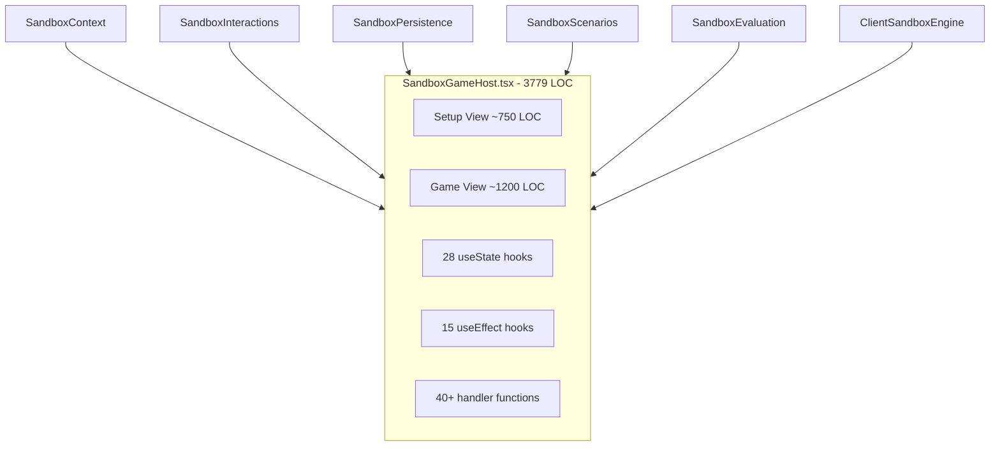
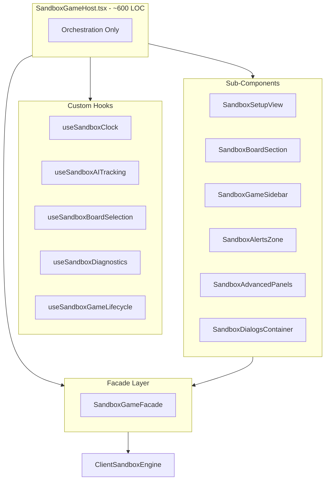
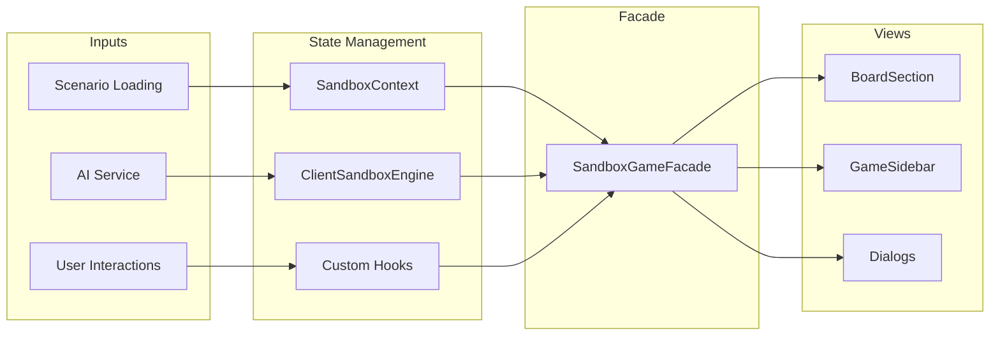

# SandboxGameHost Decomposition Plan

> **Doc Status (2025-12-23): Active**
>
> Detailed decomposition plan for refactoring `SandboxGameHost.tsx` from a 3,779-line mega-component into composable, testable modules.
>
> **Related Documents:**
>
> - [`docs/architecture/REFACTORING_OPPORTUNITIES_ANALYSIS.md`](REFACTORING_OPPORTUNITIES_ANALYSIS.md)
> - [`docs/architecture/CLIENT_SANDBOX_ENGINE_REFACTOR_PROPOSAL.md`](CLIENT_SANDBOX_ENGINE_REFACTOR_PROPOSAL.md)
> - [`src/client/facades/GameFacade.ts`](../../src/client/facades/GameFacade.ts)
> - [`src/client/pages/BackendGameHost.tsx`](../../src/client/pages/BackendGameHost.tsx)

---

## Executive Summary

[`SandboxGameHost.tsx`](../../src/client/pages/SandboxGameHost.tsx) is the largest React component in the codebase at **3,779 lines**, containing:

- **~28 useState calls** for local state management
- **~15 useEffect hooks** for side effects and synchronization
- **~40 handler functions** for user interactions
- **Mixed concerns**: game state, AI control, persistence, scenario loading, board interactions, history/replay, diagnostics

This plan proposes decomposing the component into:

1. **5 custom hooks** extracting related state clusters
2. **6 sub-components** for view composition
3. **1 facade implementation** to bridge with the existing `GameFacade` abstraction

**Target LOC Reduction**: 3,779 → ~600 (orchestrator) + ~2,800 (distributed across hooks/components)

---

## 1. Current State Analysis

### 1.1 State Inventory (useState Hooks)

| Category     | State Variable                   | Type                              | Purpose                       | Lines   |
| ------------ | -------------------------------- | --------------------------------- | ----------------------------- | ------- |
| **UI/Modal** | `isSandboxVictoryModalDismissed` | `boolean`                         | Victory modal dismissed state | 416     |
| **UI/Modal** | `showSaveStateDialog`            | `boolean`                         | Save state dialog visibility  | 447     |
| **UI/Modal** | `showBoardControls`              | `boolean`                         | Board controls overlay        | 470     |
| **AI**       | `aiThinkingStartedAt`            | `number \| null`                  | AI turn timing tracking       | 419     |
| **AI**       | `aiLadderHealth`                 | `Record<string, unknown> \| null` | AI ladder diagnostics         | 450-452 |
| **AI**       | `aiLadderHealthError`            | `string \| null`                  | AI ladder error state         | 451     |
| **AI**       | `aiLadderHealthLoading`          | `boolean`                         | AI ladder loading state       | 452     |
| **Clock**    | `sandboxClockEnabled`            | `boolean`                         | Time control toggle           | 422     |
| **Clock**    | `sandboxTimeControl`             | `{initialTimeMs, incrementMs}`    | Time control settings         | 423-428 |
| **Clock**    | `sandboxPlayerTimes`             | `Record<number, number>`          | Per-player time remaining     | 431     |
| **Board**    | `selected`                       | `Position \| undefined`           | Selected cell position        | 438     |
| **Board**    | `validTargets`                   | `Position[]`                      | Valid move targets            | 439     |
| **Board**    | `recentLineHighlights`           | `Position[]`                      | Transient line highlights     | 894     |
| **Replay**   | `_requestedReplayGameId`         | `string \| null`                  | Self-play replay ID           | 444     |
| **Sidebar**  | `showAdvancedSidebarPanels`      | `boolean`                         | Sidebar panel toggle          | 476-483 |
| **Setup**    | `showAdvancedOptions`            | `boolean`                         | Setup options visibility      | 888     |

**Additional state from extracted hooks:**

- `useSandbox()`: 15+ context values including config, sandboxEngine, pending choices
- `useBoardOverlays()`: 4 overlay boolean states
- `useSandboxPersistence()`: 5+ persistence states
- `useSandboxEvaluation()`: 4 evaluation states
- `useSandboxScenarios()`: 15+ scenario/replay states

### 1.2 Effect Inventory (useEffect Hooks)

| Effect                    | Dependencies                                                                                  | Purpose                                  | Lines     |
| ------------------------- | --------------------------------------------------------------------------------------------- | ---------------------------------------- | --------- |
| LocalStorage sidebar sync | `showAdvancedSidebarPanels`                                                                   | Persist sidebar preference               | 485-495   |
| Preset URL param handler  | `presetParam, setSearchParams`                                                                | Handle `?preset=` URL param              | 1103-1130 |
| Phase change logger       | `sandboxGameState`                                                                            | Debug logging for phase transitions      | 1529-1574 |
| Chain capture target init | `sandboxEngine, sandboxGameState, validTargets.length`                                        | Initialize chain capture targets on load | 1576-1594 |
| AI thinking tracker       | `sandboxEngine, sandboxGameState`                                                             | Track AI turn timing                     | 1601-1619 |
| AI turn trigger           | `sandboxEngine, sandboxGameState, maybeRunSandboxAiIfNeeded`                                  | Auto-trigger AI moves                    | 1621-1646 |
| Clock initialization      | `sandboxClockEnabled, sandboxGameState, sandboxTimeControl.initialTimeMs, sandboxPlayerTimes` | Initialize player times                  | 1648-1666 |
| Turn change handler       | `sandboxClockEnabled, sandboxGameState`                                                       | Apply time increment on turn change      | 1668-1702 |
| Clock decrement           | `sandboxClockEnabled, sandboxGameState, sandboxPlayerTimes`                                   | 1s countdown interval                    | 1704-1734 |
| History snapshot check    | `isViewingHistory, historyViewIndex, sandboxEngine`                                           | Disable history if no snapshots          | 1403-1411 |
| Victory tracker           | `sandboxVictoryResult, markGameCompleted, lastLoadedScenario`                                 | Onboarding/telemetry on victory          | 1373-1393 |
| Line highlight consumer   | `sandboxEngine, _sandboxStateVersion`                                                         | Consume transient line highlights        | 925-951   |
| Keyboard handler          | `isConfigured, sandboxEngine, showBoardControls`                                              | Escape key handler                       | 2114-2142 |
| BoardView debug logger    | Phase-specific                                                                                | Debug logging for line_processing        | 1899-1927 |

### 1.3 Handler Function Inventory

| Handler                           | Purpose                         | Approx Lines | Domain      |
| --------------------------------- | ------------------------------- | ------------ | ----------- |
| `handleSetupChange`               | Update config partial           | 15           | Setup       |
| `handlePlayerTypeChange`          | Toggle player type              | 10           | Setup       |
| `handleAIDifficultyChange`        | Update AI difficulty            | 10           | Setup       |
| `handleQuickStartPreset`          | Apply quick-start preset        | 30           | Setup       |
| `handleStartLocalGame`            | Start local sandbox             | 5            | Setup       |
| `startLocalSandboxGame`           | Initialize local engine         | 30           | Game Init   |
| `startSandboxGame`                | Attempt backend then local      | 60           | Game Init   |
| `setAllPlayerTypes`               | Bulk player type change         | 15           | Setup       |
| `handleCopySandboxTrace`          | Copy AI trace to clipboard      | 30           | Diagnostics |
| `handleCopySandboxAiMeta`         | Copy AI metadata                | 25           | Diagnostics |
| `handleRefreshAiLadderHealth`     | Fetch ladder health             | 35           | Diagnostics |
| `handleCopyAiLadderHealth`        | Copy ladder health              | 25           | Diagnostics |
| `handleCopySandboxFixture`        | Copy test fixture               | 25           | Diagnostics |
| `handleExportScenarioJson`        | Export scenario JSON            | 20           | Persistence |
| `handleLoadScenario`              | Load scenario with replay       | 80           | Scenarios   |
| `handleForkFromReplay`            | Fork from replay position       | 15           | Scenarios   |
| `handleResetScenario`             | Reset to original scenario      | 10           | Scenarios   |
| `handleStartTutorial`             | Start tutorial preset           | 10           | Onboarding  |
| `createSandboxInteractionHandler` | Factory for interaction handler | 60           | Engine      |

### 1.4 View Structure

The component renders two major branches:

1. **Pre-game setup view** (~750 lines, 2149-2594)
   - Header with mode toggle
   - Quick-start presets grid
   - Advanced options section
   - Scenario picker sections
   - Player/board configuration
   - Summary panel

2. **Active game view** (~1,200 lines, 2598-3778)
   - Screen reader announcer
   - Status banners
   - Victory modal
   - Choice dialog
   - Main layout with board and sidebar
   - Board section with controls
   - Sidebar with HUD, panels, diagnostics
   - Modal dialogs

---

## 2. Proposed Architecture

### 2.1 Component Tree Diagram

```
SandboxGameHost (orchestrator, ~600 LOC)
├── SandboxSetupView (~750 LOC)
│   ├── SandboxSetupHeader
│   ├── QuickStartPresetsGrid
│   ├── ScenarioPickerSection
│   └── GameConfigurationPanel
│       ├── PlayerSeatsConfig
│       ├── BoardTypeSelector
│       └── GameConfigSummary
│
└── SandboxGameView (~500 LOC orchestrator)
    ├── SandboxGameBoardSection (~400 LOC)
    │   ├── BoardHeader
    │   ├── ReplayModeIndicator
    │   ├── BoardView (existing)
    │   ├── BoardInfoPanel
    │   └── VictoryConditionsPanel (existing)
    │
    ├── SandboxGameSidebar (~300 LOC)
    │   ├── GameHUD/MobileGameHUD (existing)
    │   ├── AIThinkTimeProgress (existing)
    │   ├── SandboxAlertsZone
    │   ├── AdvancedPanels (collapsible)
    │   └── SandboxTouchControlsPanel (existing)
    │
    └── SandboxDialogs (~50 LOC)
        ├── VictoryModal (existing)
        ├── ChoiceDialog (existing)
        ├── RingPlacementCountDialog (existing)
        ├── RecoveryLineChoiceDialog (existing)
        ├── TerritoryRegionChoiceDialog (existing)
        ├── BoardControlsOverlay (existing)
        ├── SaveStateDialog (existing)
        └── ScenarioPickerModal (existing)
```

### 2.2 Hook Extraction Plan

#### Hook 1: `useSandboxClock` (New)

**Extracted from**: Lines 422-434, 1648-1734

**State**:

- `clockEnabled: boolean`
- `timeControl: { initialTimeMs, incrementMs }`
- `playerTimes: Record<number, number>`

**Effects**:

- Initialize player times when clock enabled
- Handle turn change increment
- 1-second decrement interval

**Interface**:

```typescript
interface UseSandboxClockReturn {
  clockEnabled: boolean;
  setClockEnabled: (enabled: boolean) => void;
  timeControl: { initialTimeMs: number; incrementMs: number };
  playerTimes: Record<number, number>;
  onTurnChange: (prevPlayer: number, currentPlayer: number) => void;
}

function useSandboxClock(gameState: GameState | null, numPlayers: number): UseSandboxClockReturn;
```

#### Hook 2: `useSandboxAITracking` (New)

**Extracted from**: Lines 419, 450-452, 1601-1619, 1621-1646, 1206-1266, 1183-1204

**State**:

- `aiThinkingStartedAt: number | null`
- `aiLadderHealth: Record<string, unknown> | null`
- `aiLadderHealthError: string | null`
- `aiLadderHealthLoading: boolean`

**Effects**:

- Track AI thinking start/end
- Auto-trigger AI turns

**Interface**:

```typescript
interface UseSandboxAITrackingReturn {
  aiThinkingStartedAt: number | null;
  aiLadderHealth: Record<string, unknown> | null;
  aiLadderHealthError: string | null;
  aiLadderHealthLoading: boolean;
  refreshLadderHealth: () => Promise<void>;
  copyLadderHealth: () => Promise<void>;
  copyAiMeta: () => Promise<void>;
  copyAiTrace: () => Promise<void>;
}

function useSandboxAITracking(
  engine: ClientSandboxEngine | null,
  gameState: GameState | null,
  config: LocalConfig,
  maybeRunAI: () => void
): UseSandboxAITrackingReturn;
```

#### Hook 3: `useSandboxBoardSelection` (New)

**Extracted from**: Lines 438-439, 894, 1576-1594, and selection-related logic

**State**:

- `selected: Position | undefined`
- `validTargets: Position[]`
- `recentLineHighlights: Position[]`

**Effects**:

- Initialize chain capture targets on scenario load
- Consume line highlights

**Interface**:

```typescript
interface UseSandboxBoardSelectionReturn {
  selected: Position | undefined;
  setSelected: (pos: Position | undefined) => void;
  validTargets: Position[];
  setValidTargets: (targets: Position[]) => void;
  recentLineHighlights: Position[];
  clearSelection: () => void;
}

function useSandboxBoardSelection(
  engine: ClientSandboxEngine | null,
  gameState: GameState | null,
  stateVersion: number
): UseSandboxBoardSelectionReturn;
```

#### Hook 4: `useSandboxDiagnostics` (New)

**Extracted from**: Lines 1154-1180, 1268-1311, fixture/scenario export handlers

**State**:

- Export handlers grouped together

**Interface**:

```typescript
interface UseSandboxDiagnosticsReturn {
  copySandboxFixture: () => Promise<void>;
  exportScenarioJson: () => void;
  showSaveStateDialog: boolean;
  setShowSaveStateDialog: (show: boolean) => void;
}

function useSandboxDiagnostics(gameState: GameState | null): UseSandboxDiagnosticsReturn;
```

#### Hook 5: `useSandboxGameLifecycle` (New)

**Extracted from**: Lines 984-1074, 1076-1099, 1133-1149, game start/reset logic

**Interface**:

```typescript
interface UseSandboxGameLifecycleReturn {
  startGame: (config: LocalConfig) => Promise<void>;
  applyQuickStartPreset: (preset: QuickStartPreset) => void;
  resetToSetup: () => void;
  rematch: () => void;
}

function useSandboxGameLifecycle(
  config: LocalConfig,
  setConfig: (c: LocalConfig) => void,
  initEngine: (...args) => ClientSandboxEngine | null,
  resetEngine: () => void,
  resetUIState: () => void,
  clearScenarioContext: () => void,
  navigate: NavigateFunction
): UseSandboxGameLifecycleReturn;
```

### 2.3 Facade Implementation: `SandboxGameFacade`

Implement the existing [`GameFacade`](../../src/client/facades/GameFacade.ts) interface for sandbox:

```typescript
// src/client/facades/SandboxGameFacade.ts

class SandboxGameFacade implements GameFacade {
  constructor(
    private engine: ClientSandboxEngine,
    private config: LocalConfig,
    private userId: string | undefined
  ) {}

  get gameState() { return this.engine.getGameState(); }
  get validMoves() { return this.engine.getValidMoves(...); }
  get victoryState() { return this.engine.getVictoryResult(); }
  get gameEndExplanation() { return this.engine.getGameEndExplanation(); }
  get mode() { return 'sandbox' as const; }
  get connectionStatus() { return 'local-only' as const; }
  get isPlayer() { return true; }
  get isMyTurn() { return this.isHumanTurn(); }
  get boardType() { return this.engine.getGameState().boardType; }
  // ... etc
}
```

This enables sharing UI components between Backend and Sandbox hosts.

### 2.4 Sub-Component Extraction

#### Component 1: `SandboxSetupView`

**Location**: `src/client/components/sandbox/SandboxSetupView.tsx`

**Extracted from**: Lines 2149-2594 (setup branch)

**Props**:

```typescript
interface SandboxSetupViewProps {
  config: LocalConfig;
  onConfigChange: (partial: Partial<LocalConfig>) => void;
  onStartGame: () => void;
  onQuickStartPreset: (preset: QuickStartPreset) => void;
  onLoadScenario: (scenario: LoadableScenario) => void;
  onShowSelfPlayBrowser: () => void;
  isFirstTimePlayer: boolean;
  developerToolsEnabled: boolean;
  isBeginnerMode: boolean;
  onModeChange: (mode: 'beginner' | 'debug') => void;
  user: User | null;
}
```

**Internal subcomponents**:

- `QuickStartPresetsGrid`
- `PlayerSeatsConfig`
- `BoardTypeSelector`
- `GameConfigSummary`

#### Component 2: `SandboxBoardSection`

**Location**: `src/client/components/sandbox/SandboxBoardSection.tsx`

**Extracted from**: Lines 2736-2966

**Props**:

```typescript
interface SandboxBoardSectionProps {
  gameState: GameState;
  boardViewModel: BoardViewModel;
  selected: Position | undefined;
  validTargets: Position[];
  overlays: BoardOverlays;
  isReplayMode: boolean;
  pendingAnimation: MoveAnimation | null;
  chainCapturePath: Position[] | undefined;
  shakingCellKey: string | null;
  onCellClick: (pos: Position) => void;
  onCellDoubleClick: (pos: Position) => void;
  onCellContextMenu: (pos: Position) => void;
  onShowBoardControls: () => void;
  onAnimationComplete: () => void;
  // Debug/export handlers
  onSaveState: () => void;
  onExportScenario: () => void;
  onCopyFixture: () => void;
  onLoadScenario: () => void;
  onResetScenario: () => void;
  onChangeSetup: () => void;
  // Config
  lastLoadedScenario: LoadedScenario | null;
  isBeginnerMode: boolean;
  developerToolsEnabled: boolean;
}
```

#### Component 3: `SandboxGameSidebar`

**Location**: `src/client/components/sandbox/SandboxGameSidebar.tsx`

**Extracted from**: Lines 2970-3723

**Props**:

```typescript
interface SandboxGameSidebarProps {
  hudViewModel: HUDViewModel;
  gameState: GameState;
  config: LocalConfig;
  facade?: SandboxGameFacade;
  // Scenario context
  lastLoadedScenario: LoadedScenario | null;
  // Replay state
  isInReplayMode: boolean;
  isViewingHistory: boolean;
  historyViewIndex: number;
  hasHistorySnapshots: boolean;
  onReplayStateChange: (state: GameState | null) => void;
  onReplayModeChange: (mode: boolean) => void;
  onForkFromReplay: (state: GameState) => void;
  onHistoryIndexChange: (index: number) => void;
  // AI tracking
  aiThinkingStartedAt: number | null;
  aiDifficulty: number;
  // Evaluation
  evaluationHistory: PositionEvaluationPayload['data'][];
  evaluationError: string | null;
  isEvaluating: boolean;
  onRequestEvaluation: () => void;
  // Recording
  autoSaveGames: boolean;
  onAutoSaveChange: (enabled: boolean) => void;
  gameSaveStatus: SaveStatus;
  pendingLocalGames: number;
  syncState: SyncState | null;
  // Touch controls
  selection: SelectionState;
  overlays: BoardOverlays;
  onOverlayChange: (overlay: string, value: boolean) => void;
  phaseLabel: string;
  phaseHint?: string;
  // Skip handlers
  canSkipCapture: boolean;
  onSkipCapture?: () => void;
  canSkipTerritoryProcessing: boolean;
  onSkipTerritoryProcessing?: () => void;
  canSkipRecovery: boolean;
  onSkipRecovery?: () => void;
  // State
  showAdvancedPanels: boolean;
  onAdvancedPanelsToggle: (show: boolean) => void;
  isBeginnerMode: boolean;
  developerToolsEnabled: boolean;
  isMobile: boolean;
}
```

#### Component 4: `SandboxAlertsZone`

**Location**: `src/client/components/sandbox/SandboxAlertsZone.tsx`

**Extracted from**: Lines 3037-3089

**Props**:

```typescript
interface SandboxAlertsZoneProps {
  lastLoadedScenario: LoadedScenario | null;
  gameState: GameState;
  engine: ClientSandboxEngine;
  onSwapSides: () => void;
}
```

#### Component 5: `SandboxAdvancedPanels`

**Location**: `src/client/components/sandbox/SandboxAdvancedPanels.tsx`

**Extracted from**: Lines 3092-3593

Contains: ReplayPanel, HistoryPlaybackPanel, MoveHistory, GameEventLog, Recording panel, Evaluation panel, AI diagnostics

#### Component 6: `SandboxDialogsContainer`

**Location**: `src/client/components/sandbox/SandboxDialogsContainer.tsx`

**Extracted from**: Lines 3726-3777

Groups all modal/dialog rendering with conditional logic.

---

## 3. Migration Strategy

### Phase 1: Extract Hooks (Low Risk)

**Goal**: Move state and effects into custom hooks without changing behavior.

**Steps**:

1. Create `hooks/useSandboxClock.ts`
2. Create `hooks/useSandboxAITracking.ts`
3. Create `hooks/useSandboxBoardSelection.ts`
4. Create `hooks/useSandboxDiagnostics.ts`
5. Create `hooks/useSandboxGameLifecycle.ts`
6. Update SandboxGameHost to use new hooks
7. Run existing tests to verify no regressions

**Testing Strategy**:

- Existing E2E tests should pass unchanged
- Add unit tests for each extracted hook
- Verify sandbox games work end-to-end

**Rollback**: Revert hook files and inline state back into SandboxGameHost.

### Phase 2: Implement SandboxGameFacade (Low-Medium Risk)

**Goal**: Create facade implementation to enable UI sharing.

**Steps**:

1. Create `facades/SandboxGameFacade.ts` implementing `GameFacade`
2. Add `useSandboxFacade` hook to instantiate facade from engine
3. Wire facade into SandboxGameHost
4. Verify all facade methods work correctly

**Testing Strategy**:

- Unit test facade methods
- Existing E2E tests validate integration

**Rollback**: Remove facade usage, keep direct engine access.

### Phase 3: Extract Sub-Components (Medium Risk)

**Goal**: Split view rendering into composable sub-components.

**Extraction Order** (safest first):

1. `SandboxAlertsZone` (small, self-contained)
2. `SandboxDialogsContainer` (groups existing components)
3. `SandboxAdvancedPanels` (complex but isolated)
4. `SandboxGameSidebar` (composes multiple panels)
5. `SandboxBoardSection` (core game view)
6. `SandboxSetupView` (entire setup branch)

**Per-Component Process**:

1. Create component file with extracted JSX
2. Define props interface
3. Replace inline JSX with component usage
4. Verify behavior unchanged via E2E tests
5. Add component-level tests

**Testing Strategy**:

- Visual regression tests (if available)
- E2E gameplay tests
- Component unit tests for new components

**Rollback**: Per-component - inline JSX back if issues arise.

### Phase 4: Unify with BackendGameHost (Higher Risk)

**Goal**: Share components between sandbox and backend hosts using GameFacade.

**Steps**:

1. Create `BackendGameFacade` implementing `GameFacade`
2. Identify shared components that can accept `GameFacade` instead of raw props
3. Gradually migrate components to facade-based props
4. Extract truly shared components to `components/game/`

**Deferred**: This phase is optional and higher risk. Consider after Phase 3 stabilizes.

---

## 4. Risk Assessment

### Regression Risks

| Risk                              | Likelihood | Impact | Mitigation                                             |
| --------------------------------- | ---------- | ------ | ------------------------------------------------------ |
| AI turn timing breaks             | Medium     | High   | Test AI vs AI games, timing diagnostics                |
| Clock increment logic breaks      | Low        | Medium | Unit test clock hook extensively                       |
| Scenario loading breaks           | Medium     | High   | Test all scenario types (fixture, self-play, teaching) |
| Chain capture highlighting breaks | Low        | Medium | Existing E2E tests cover chain captures                |
| Victory detection breaks          | Low        | High   | Existing contract vector tests cover victory           |
| Keyboard shortcuts break          | Low        | Low    | Manual testing of shortcuts                            |

### Testing Requirements

**Before Phase 1**:

- [ ] Document all existing E2E tests that cover sandbox
- [ ] Run full E2E suite and capture baseline
- [ ] Create sandbox-specific test scenarios if gaps exist

**Per Phase**:

- [ ] Run E2E suite after each component extraction
- [ ] Manual smoke test: quick game, scenario load, AI game
- [ ] Verify dev tools and diagnostics work

### Rollback Strategy

Each phase is independently rollbackable:

1. **Phase 1 Rollback**: Delete hook files, restore inline state
2. **Phase 2 Rollback**: Remove facade import, keep direct engine usage
3. **Phase 3 Rollback**: Per-component, inline JSX back

Git strategy: Create feature branch per phase, squash-merge only after green CI.

---

## 5. Implementation Checklist

### Phase 1: Hook Extraction

- [ ] Create `src/client/hooks/useSandboxClock.ts`
  - [ ] Extract clock state (Lines 422-434)
  - [ ] Extract clock effects (Lines 1648-1734)
  - [ ] Add unit tests
- [ ] Create `src/client/hooks/useSandboxAITracking.ts`
  - [ ] Extract AI tracking state (Lines 419, 450-452)
  - [ ] Extract AI tracking effects (Lines 1601-1646)
  - [ ] Extract diagnostic handlers (Lines 1183-1266)
  - [ ] Add unit tests
- [ ] Create `src/client/hooks/useSandboxBoardSelection.ts`
  - [ ] Extract selection state (Lines 438-439, 894)
  - [ ] Extract selection effects (Lines 925-951, 1576-1594)
  - [ ] Add unit tests
- [ ] Create `src/client/hooks/useSandboxDiagnostics.ts`
  - [ ] Extract export handlers (Lines 1268-1311)
  - [ ] Add unit tests
- [ ] Create `src/client/hooks/useSandboxGameLifecycle.ts`
  - [ ] Extract game start logic (Lines 984-1074)
  - [ ] Extract preset handlers (Lines 1076-1099)
  - [ ] Add unit tests
- [ ] Update SandboxGameHost to use hooks
- [ ] Run E2E tests
- [ ] Manual smoke test

### Phase 2: Facade Implementation

- [ ] Create `src/client/facades/SandboxGameFacade.ts`
  - [ ] Implement all GameFacade interface methods
  - [ ] Add unit tests
- [ ] Create `src/client/hooks/useSandboxFacade.ts`
  - [ ] Instantiate facade from engine/config
  - [ ] Handle null engine case
- [ ] Wire facade into SandboxGameHost
- [ ] Verify all derived state works correctly
- [ ] Run E2E tests

### Phase 3: Component Extraction

- [ ] Create `src/client/components/sandbox/SandboxAlertsZone.tsx`
- [ ] Create `src/client/components/sandbox/SandboxDialogsContainer.tsx`
- [ ] Create `src/client/components/sandbox/SandboxAdvancedPanels.tsx`
- [ ] Create `src/client/components/sandbox/SandboxGameSidebar.tsx`
- [ ] Create `src/client/components/sandbox/SandboxBoardSection.tsx`
- [ ] Create `src/client/components/sandbox/SandboxSetupView.tsx`
- [ ] Update SandboxGameHost to use sub-components
- [ ] Run E2E tests
- [ ] Manual smoke test all game modes

### Phase 4: Optional Unification

- [ ] Create `src/client/facades/BackendGameFacade.ts`
- [ ] Identify shared component opportunities
- [ ] Create unified game components
- [ ] Test both hosts with shared components

---

## 6. Success Metrics

| Metric                             | Current  | Target                  |
| ---------------------------------- | -------- | ----------------------- |
| SandboxGameHost.tsx LOC            | 3,779    | ~600                    |
| useState calls in SandboxGameHost  | ~28      | ~8 (delegated to hooks) |
| useEffect hooks in SandboxGameHost | ~15      | ~3                      |
| Largest component file             | 3,779    | <800                    |
| Time to understand sandbox flow    | ~2 hours | <30 min                 |

---

## 7. Architecture Diagrams

### Current Architecture



### Target Architecture



### Data Flow



---

## Appendix A: File Locations

| New File                                                    | Purpose                   |
| ----------------------------------------------------------- | ------------------------- |
| `src/client/hooks/useSandboxClock.ts`                       | Clock state management    |
| `src/client/hooks/useSandboxAITracking.ts`                  | AI timing and diagnostics |
| `src/client/hooks/useSandboxBoardSelection.ts`              | Board selection state     |
| `src/client/hooks/useSandboxDiagnostics.ts`                 | Export and debug handlers |
| `src/client/hooks/useSandboxGameLifecycle.ts`               | Game start/reset logic    |
| `src/client/facades/SandboxGameFacade.ts`                   | Facade implementation     |
| `src/client/hooks/useSandboxFacade.ts`                      | Facade instantiation hook |
| `src/client/components/sandbox/SandboxSetupView.tsx`        | Setup view component      |
| `src/client/components/sandbox/SandboxBoardSection.tsx`     | Board section component   |
| `src/client/components/sandbox/SandboxGameSidebar.tsx`      | Sidebar component         |
| `src/client/components/sandbox/SandboxAlertsZone.tsx`       | Alerts component          |
| `src/client/components/sandbox/SandboxAdvancedPanels.tsx`   | Advanced panels           |
| `src/client/components/sandbox/SandboxDialogsContainer.tsx` | Dialogs container         |

---

## Appendix B: Constant Definitions to Extract

Consider extracting these constants to a shared module:

| Constant              | Location      | New Location                                |
| --------------------- | ------------- | ------------------------------------------- |
| `BOARD_PRESETS`       | Lines 88-118  | `src/client/constants/boardPresets.ts`      |
| `QUICK_START_PRESETS` | Lines 121-306 | `src/client/constants/quickStartPresets.ts` |
| `PLAYER_TYPE_META`    | Lines 308-324 | `src/client/constants/playerTypes.ts`       |
| `PHASE_COPY`          | Lines 326-364 | `src/client/constants/phaseCopy.ts`         |

---

## Revision History

| Date       | Author                  | Changes              |
| ---------- | ----------------------- | -------------------- |
| 2025-12-23 | Claude (Architect mode) | Initial plan created |
