# Python Phase Transition Alignment Design (PAR-08)

## Executive Summary

This document describes the design for fixing Python's phase transition behavior to align with TypeScript's canonical phase orchestrator. The core issue is that Python's [`phase_machine.py`](../../ai-service/app/rules/phase_machine.py) auto-advances through empty phases internally after capture moves, while TypeScript's [`turnOrchestrator.ts`](../../src/shared/engine/orchestration/turnOrchestrator.ts) requires explicit bookkeeping moves (`no_line_action`, `no_territory_action`) for each phase transition.

## Status Update (2025-12-20)

PAR-08 has been resolved by enforcing trace-mode replay semantics in canonical selfplay and by recording explicit bookkeeping moves instead of letting the engine auto-advance phases. The phase machine itself was not the culprit; the divergence came from non-trace execution paths that could implicitly resolve ANM/phase transitions without recording the required no-op moves.

Implemented fixes (see also `docs/planning/AI_TRAINING_PIPELINE_REMEDIATION_PLAN.md`):

- `DefaultRulesEngine.apply_move()` now forwards `trace_mode` to `GameEngine.apply_move` to keep replay traces canonical.
- `RingRiftEnv.step()` applies both player moves and auto-generated bookkeeping moves with `trace_mode=True`, ensuring they are recorded.
- `GameEngine.apply_move()` skips automatic ANM resolution when `trace_mode=True` so forced eliminations remain explicit.
- `GameReplayDB` records the actual phase at move time (not just derived from move type).
- Canonical selfplay gate enforces phase invariants and bookkeeping move emission.

### PAR-08 Evidence

At move k=142 after a `continue_capture_segment` move that ends a chain capture:

| Aspect      | Python                 | TypeScript |
| ----------- | ---------------------- | ---------- |
| Phase       | `territory_processing` | `movement` |
| Player      | 1                      | 2          |
| Board State | Identical              | Identical  |

The board state is identical - only phase tracking differs, indicating a phase machine divergence rather than a rules logic bug.

---

## 1. Current State Analysis

### 1.1 Python Phase Transition Architecture

Python's phase transitions are managed by two key modules:

1. **[`phase_machine.py`](../../ai-service/app/rules/phase_machine.py)** - The `advance_phases()` function that handles all phase transitions after moves
2. **[`_game_engine_legacy.py`](../../ai-service/app/_game_engine_legacy.py)** - Helper methods like `_advance_to_line_processing()` and `_advance_to_territory_processing()`

### 1.2 Key Behavior: Capture Move Handling

When a capture move ends (no continuation available), Python's `advance_phases()` at [lines 293-308](../../ai-service/app/rules/phase_machine.py) executes:

```python
elif last_move.type in (
    MoveType.OVERTAKING_CAPTURE,
    MoveType.CHAIN_CAPTURE,
    MoveType.CONTINUE_CAPTURE_SEGMENT,
):
    # Check for more captures (chain)
    capture_moves = GameEngine._get_capture_moves(
        game_state,
        current_player,
    )
    if capture_moves:
        # After the first capture, subsequent captures are chain captures
        game_state.current_phase = GamePhase.CHAIN_CAPTURE
    else:
        # End of chain - THIS IS THE PROBLEM
        GameEngine._advance_to_line_processing(game_state, trace_mode=trace_mode)
```

### 1.3 The `_advance_to_line_processing()` Method

Located at [lines 1179-1197](../../ai-service/app/_game_engine_legacy.py):

```python
@staticmethod
def _advance_to_line_processing(game_state: GameState, *, trace_mode: bool = False):
    # Clear chain_capture_state when leaving capture phase.
    game_state.chain_capture_state = None
    game_state.must_move_from_stack_key = None

    # Always enter LINE_PROCESSING phase. Per RR-CANON-R075, all phases
    # must be explicitly visited. When there are no lines to process,
    # the AI/player must select NO_LINE_ACTION which then advances to
    # territory_processing. There is no silent skipping of phases.
    game_state.current_phase = GamePhase.LINE_PROCESSING
```

**Observation**: This method correctly stops at `LINE_PROCESSING` and does NOT auto-advance. The docstring and comments indicate awareness of RR-CANON-R075.

### 1.4 Where the Problem Actually Occurs

After reviewing the code, the **actual problem** was in the selfplay/AI move generation layer, NOT in `phase_machine.py`. The phase machine correctly sets phases, but the selfplay loop was able to auto-advance through no-op phases when `trace_mode` was disabled. This has been fixed; see the status update above.

However, let me re-examine the `NO_LINE_ACTION` handler at [lines 337-366](../../ai-service/app/rules/phase_machine.py):

```python
elif last_move.type == MoveType.NO_LINE_ACTION:
    # Forced no-op: player entered line_processing but had no lines to process.
    _on_line_processing_complete(game_state, trace_mode=trace_mode)
    # If we landed in TERRITORY_PROCESSING with no regions, surface the
    # requirement so hosts record NO_TERRITORY_ACTION
    remaining_regions = GameEngine._get_territory_processing_moves(...)
    if game_state.current_phase == GamePhase.TERRITORY_PROCESSING and not remaining_regions:
        game_state.current_phase = GamePhase.TERRITORY_PROCESSING  # explicit
```

The `_on_line_processing_complete()` helper at [lines 126-140](../../ai-service/app/rules/phase_machine.py):

```python
def _on_line_processing_complete(game_state: GameState, *, trace_mode: bool) -> None:
    from app.game_engine import GameEngine

    GameEngine._advance_to_territory_processing(
        game_state,
        trace_mode=trace_mode,
    )
```

And `_advance_to_territory_processing()` at [lines 1200-1214](../../ai-service/app/_game_engine_legacy.py):

```python
@staticmethod
def _advance_to_territory_processing(game_state: GameState, *, trace_mode: bool = False):
    game_state.current_phase = GamePhase.TERRITORY_PROCESSING
```

### 1.5 Confirmed: The Python Phase Machine is Correct

After thorough analysis, **Python's phase_machine.py is correctly implemented**. It:

1. Stops at `LINE_PROCESSING` after capture ends (not auto-advancing)
2. Requires explicit `NO_LINE_ACTION` move to advance to `TERRITORY_PROCESSING`
3. Stops at `TERRITORY_PROCESSING` (not auto-advancing)
4. Requires explicit `NO_TERRITORY_ACTION` move to trigger turn rotation

### 1.6 Where the Real Divergence Occurs

The PAR-08 divergence at k=142 showing Python at `territory_processing, player=1` vs TS at `movement, player=2` suggests that:

1. **Python recorded moves correctly** (had `no_line_action`, `no_territory_action` in the sequence)
2. **The replay or parity harness** may have a different phase transition interpretation
3. **Or selfplay is generating bookkeeping moves** that aren't being recorded

Let me look at the `get_phase_requirement()` method at [lines 308-395](../../ai-service/app/_game_engine_legacy.py):

```python
@staticmethod
def get_phase_requirement(game_state: GameState, player_number: int) -> PhaseRequirement | None:
    # ... checks for interactive moves first ...

    if phase == GamePhase.LINE_PROCESSING:
        return PhaseRequirement(
            type=PhaseRequirementType.NO_LINE_ACTION_REQUIRED,
            player=player_number,
            eligible_positions=[],
        )

    elif phase == GamePhase.TERRITORY_PROCESSING:
        return PhaseRequirement(
            type=PhaseRequirementType.NO_TERRITORY_ACTION_REQUIRED,
            player=player_number,
            eligible_positions=[],
        )
```

This is correct - it surfaces the requirement for bookkeeping moves when no interactive moves exist.

---

## 2. Target State: TypeScript Behavior

### 2.1 TypeScript Phase Transition Architecture

TypeScript's phase transitions are managed by:

1. **[`turnOrchestrator.ts`](../../src/shared/engine/orchestration/turnOrchestrator.ts)** - The `processTurn()` function
2. **[`applyMoveWithChainInfo()`](../../src/shared/engine/orchestration/turnOrchestrator.ts)** - Move application with chain capture info
3. **FSM helpers** - `onLineProcessingComplete()`, `onTerritoryProcessingComplete()`

### 2.2 Key Behavior: Explicit Phase Transitions

After capture moves, TS at [lines 2160-2191](../../src/shared/engine/orchestration/turnOrchestrator.ts):

```typescript
case 'overtaking_capture':
case 'continue_capture_segment': {
  const outcome = applyCaptureSegment(state, {...});
  // ... update mustMoveFromStackKey ...
  if (outcome.chainContinuationRequired) {
    return {
      nextState: updatedState,
      chainCaptureRequired: true,
      chainCapturePosition: move.to,
    };
  }
  return { nextState: updatedState };
}
```

**Key observation**: TS does NOT auto-advance to line_processing after capture. The phase transition happens in `processPostMovePhases()` which:

1. Transitions to `line_processing`
2. Returns control with a `pendingDecision` if no lines exist
3. Waits for explicit `no_line_action` move
4. Then transitions to `territory_processing`
5. Waits for explicit `no_territory_action` move

### 2.3 The `no_line_action` Handler

At [lines 2205-2217](../../src/shared/engine/orchestration/turnOrchestrator.ts):

```typescript
case 'no_line_action': {
  // Explicit no-op in line_processing phase when no lines exist for the
  // current player (RR-CANON-R075). State is unchanged; advance to
  // territory_processing so that the rest of the turn can proceed.
  return {
    nextState: {
      ...state,
      currentPlayer: move.player,
      currentPhase: 'territory_processing' as GamePhase,
    },
  };
}
```

### 2.4 The `no_territory_action` Handler

At [lines 2230-2270](../../src/shared/engine/orchestration/turnOrchestrator.ts):

```typescript
case 'no_territory_action': {
  // RR-PARITY-FIX-2025-12-20: Must complete phase transition inline for replay parity.
  const hadAnyAction = computeHadAnyActionThisTurn(state, move);
  const hasStacks = playerHasStacksOnBoard(state, move.player);

  if (!hadAnyAction && hasStacks) {
    return {
      nextState: {
        ...state,
        currentPlayer: move.player,
        currentPhase: 'forced_elimination' as GamePhase,
      },
    };
  }

  // No forced elimination needed - rotate to next player
  const { nextPlayer } = computeNextNonEliminatedPlayer(...);
  return {
    nextState: {
      ...state,
      currentPlayer: nextPlayer,
      currentPhase: 'ring_placement' as GamePhase,
    },
  };
}
```

---

## 3. Root Cause Diagnosis

Based on the analysis, the root cause is **NOT** in `phase_machine.py` or `_game_engine_legacy.py`. Both are correctly implemented. The divergence was caused by non-trace execution paths that allowed implicit phase/ANM advancement without recording required no-op moves.

### 3.1 Likely Root Causes

1. **Selfplay Data Generation**: The selfplay loop may be auto-generating and applying bookkeeping moves without recording them to the replay DB

2. **Parity Test Replay Harness**: The TS replay harness or Python replay harness may have different phase interpretations

3. **Move Recording Gap**: Bookkeeping moves generated via `synthesize_bookkeeping_move()` may not be consistently recorded

### 3.2 Evidence from PAR-08

The divergence at k=142 shows:

- Python: `phase=territory_processing, player=1`
- TS: `phase=movement, player=2`

This suggests Python's state at k=142 includes more moves than TS expected. Specifically:

- Python may have internally advanced through `no_line_action` and landed in `territory_processing`
- While TS is still waiting for explicit bookkeeping moves after the capture ended

---

## 4. Implemented Changes (2025-12-20)

### 4.1 Investigation First

Before making code changes, we need to verify:

1. **Check selfplay recording**: Are `no_line_action` and `no_territory_action` moves being recorded?
2. **Check replay harness**: Does the Python replay apply moves correctly?
3. **Check state bundle k=142**: What moves precede the divergence?

### 4.2 Fix: Ensure Explicit Bookkeeping Move Recording

If the investigation confirms that bookkeeping moves are being auto-applied but not recorded, the fix is in the **selfplay/AI loop**, not the phase machine. This has been implemented by enforcing trace-mode replay semantics and recording every synthesized bookkeeping move.

#### Location: Selfplay Loop

The selfplay loop should:

```python
# When get_valid_moves returns empty
requirement = GameEngine.get_phase_requirement(state, player)
if requirement:
    bookkeeping_move = GameEngine.synthesize_bookkeeping_move(requirement, state)
    # MUST RECORD THIS MOVE
    state = GameEngine.apply_move(state, bookkeeping_move, trace_mode=True)
    db.record_move(game_id, bookkeeping_move)  # Critical!
```

#### Files to Check

1. **[`ai-service/scripts/generate_canonical_selfplay.py`](../../ai-service/scripts/generate_canonical_selfplay.py)** - Main selfplay driver
2. **[`ai-service/app/training/selfplay_config.py`](../../ai-service/app/training/selfplay_config.py)** - Selfplay configuration
3. **[`ai-service/app/db/unified_recording.py`](../../ai-service/app/db/unified_recording.py)** - Unified game recording

### 4.3 Alternative: If Phase Machine Needs Fixes

If the investigation shows `phase_machine.py` IS auto-advancing somewhere, the fix would be:

#### File: `ai-service/app/rules/phase_machine.py`

**Current behavior** (hypothetical issue):

```python
def _on_line_processing_complete(game_state, trace_mode):
    GameEngine._advance_to_territory_processing(game_state, trace_mode=trace_mode)
    # Potentially more auto-advancement here
```

**Required behavior**:

```python
def _on_line_processing_complete(game_state, trace_mode):
    # ONLY set the phase - do NOT advance further
    game_state.current_phase = GamePhase.TERRITORY_PROCESSING
    # Return control - host must emit no_territory_action if no regions
```

But based on my analysis, the current code already does this correctly.

---

## 5. Risk Assessment

### 5.1 What Could Break

| Risk                                       | Severity | Mitigation                         |
| ------------------------------------------ | -------- | ---------------------------------- |
| Existing selfplay DBs become non-canonical | High     | Regenerate all training DBs        |
| AI move generation breaks                  | Medium   | AI must generate bookkeeping moves |
| Parity tests fail                          | Low      | Expected - need to fix parity      |
| Training pipeline disruption               | Medium   | Mark affected DBs as legacy        |

### 5.2 Backward Compatibility

1. **Existing DBs**: Mark all pre-fix DBs as `legacy_noncanonical` in `TRAINING_DATA_REGISTRY.md`
2. **Model compatibility**: Models trained on legacy data may need retraining
3. **Replay tolerance**: Enable `replayCompatibility` for historical replays

### 5.3 AI Move Generation Impact

The AI move generators MUST be updated to:

1. Check `get_phase_requirement()` when `get_valid_moves()` returns empty
2. Generate explicit `no_line_action` / `no_territory_action` moves
3. Include these in the canonical move sequence

---

## 6. Implementation Steps

**Note:** The checklist below is retained for historical context. Current status is tracked in `docs/planning/AI_TRAINING_PIPELINE_REMEDIATION_PLAN.md`.

### Phase 1: Diagnosis (Prerequisite)

- [ ] **Step 1.1**: Inspect PAR-08 state bundle at k=142
  - Verify: What move types appear at k=140, k=141, k=142?
  - Expected: Should see capture move, then `no_line_action`, then `no_territory_action`
  - **Verification**: Manual inspection of state bundle JSON

- [ ] **Step 1.2**: Add diagnostic logging to selfplay
  - Location: `ai-service/scripts/generate_canonical_selfplay.py`
  - Log: Every move type and phase transition
  - **Verification**: Run small selfplay game and inspect logs

- [ ] **Step 1.3**: Confirm bookkeeping move recording
  - Check: Are `no_line_action` / `no_territory_action` in recorded history?
  - Query: `SELECT * FROM moves WHERE move_type IN ('no_line_action', 'no_territory_action')`
  - **Verification**: Query existing canonical DBs

### Phase 2: Fix Implementation

- [ ] **Step 2.1**: Update selfplay loop to record bookkeeping moves
  - File: `ai-service/scripts/generate_canonical_selfplay.py`
  - Change: Always record synthesized bookkeeping moves
  - **Verification**: Run selfplay, verify DB contains bookkeeping moves

- [ ] **Step 2.2**: Update AI move selection
  - File: `ai-service/app/ai/*.py` (AI implementations)
  - Change: Check `get_phase_requirement()` when no interactive moves
  - **Verification**: AI selects `no_line_action` when in `LINE_PROCESSING` with no lines

- [ ] **Step 2.3**: Update contract vector tests
  - File: `tests/fixtures/contract-vectors/*.json`
  - Change: Add explicit bookkeeping moves to test sequences
  - **Verification**: Contract vector tests pass with new move sequences

### Phase 3: Validation

- [ ] **Step 3.1**: Run TS<->Python parity on fixed implementation
  - Command: `cd ai-service && python scripts/check_ts_python_replay_parity.py --db canonical_test.db`
  - Expected: Zero semantic divergences
  - **Verification**: Parity report shows 100% alignment

- [ ] **Step 3.2**: Regenerate canonical selfplay DBs
  - Command: `cd ai-service && python scripts/generate_canonical_selfplay.py`
  - Expected: New DBs contain explicit bookkeeping moves
  - **Verification**: Canonical history validation passes

- [ ] **Step 3.3**: Update TRAINING_DATA_REGISTRY.md
  - Mark old DBs as `legacy_noncanonical`
  - Add new canonical DBs
  - **Verification**: Registry accurately reflects DB status

---

## 7. Test Plan

### 7.1 Unit Tests

```python
# Test: Phase machine handles capture end correctly
def test_capture_end_sets_line_processing():
    state = create_state_with_capture_just_ended()
    move = create_continue_capture_segment_move()
    advance_phases(PhaseTransitionInput(state, move))
    assert state.current_phase == GamePhase.LINE_PROCESSING
    # Should NOT auto-advance to territory_processing

# Test: No-action moves are required when empty
def test_get_phase_requirement_returns_no_line_action():
    state = create_state_in_line_processing_no_lines()
    req = GameEngine.get_phase_requirement(state, state.current_player)
    assert req.type == PhaseRequirementType.NO_LINE_ACTION_REQUIRED

# Test: Synthesized bookkeeping moves work
def test_synthesize_no_line_action():
    state = create_state_in_line_processing_no_lines()
    req = GameEngine.get_phase_requirement(state, state.current_player)
    move = GameEngine.synthesize_bookkeeping_move(req, state)
    assert move.type == MoveType.NO_LINE_ACTION
    new_state = GameEngine.apply_move(state, move)
    assert new_state.current_phase == GamePhase.TERRITORY_PROCESSING
```

### 7.2 Integration Tests

```python
# Test: Full turn with bookkeeping moves
def test_full_turn_with_bookkeeping_moves():
    state = initial_game_state()
    moves = [
        place_ring_move,
        move_stack_move,
        overtaking_capture_move,  # Capture ends chain
        no_line_action_move,      # Explicit bookkeeping
        no_territory_action_move, # Explicit bookkeeping
    ]
    for move in moves:
        state = GameEngine.apply_move(state, move, trace_mode=True)

    # After no_territory_action, should rotate to next player
    assert state.current_player == 2
    assert state.current_phase == GamePhase.RING_PLACEMENT
```

### 7.3 Parity Tests

```python
# Test: TS<->Python parity with explicit bookkeeping
def test_ts_python_parity_with_bookkeeping():
    # Run the same move sequence in TS and Python
    ts_state = ts_engine.apply_moves(move_sequence)
    py_state = py_engine.apply_moves(move_sequence)

    assert ts_state.current_phase == py_state.current_phase
    assert ts_state.current_player == py_state.current_player
    assert hash_game_state(ts_state) == hash_game_state(py_state)
```

### 7.4 Contract Vector Tests

Update `tests/fixtures/contract-vectors/` with vectors that include explicit bookkeeping moves:

```json
{
  "name": "capture_ends_with_bookkeeping",
  "moves": [
    { "type": "place_ring", "player": 1, "to": "3,3" },
    { "type": "move_stack", "player": 1, "from": "3,3", "to": "5,5" },
    {
      "type": "overtaking_capture",
      "player": 1,
      "from": "5,5",
      "captureTarget": "6,6",
      "to": "7,7"
    },
    { "type": "no_line_action", "player": 1 },
    { "type": "no_territory_action", "player": 1 }
  ],
  "expectedFinalState": {
    "currentPhase": "ring_placement",
    "currentPlayer": 2
  }
}
```

---

## 8. Architecture Diagram

```mermaid
flowchart TD
    subgraph TS[TypeScript - turnOrchestrator.ts]
        A[processTurn] --> B{Move Type?}
        B -->|capture| C[applyCaptureSegment]
        C --> D{Chain continues?}
        D -->|No| E[processPostMovePhases]
        E --> F[Set phase: line_processing]
        F --> G{Lines exist?}
        G -->|Yes| H[Return: line_order decision]
        G -->|No| I[Return: no_line_action_required]
        I --> J[Host applies no_line_action]
        J --> K[Set phase: territory_processing]
        K --> L{Regions exist?}
        L -->|No| M[Return: no_territory_action_required]
        M --> N[Host applies no_territory_action]
        N --> O[Rotate to next player]
    end

    subgraph PY[Python - phase_machine.py]
        PA[advance_phases] --> PB{Move Type?}
        PB -->|capture| PC[Check chain continuation]
        PC --> PD{Chain continues?}
        PD -->|No| PE[_advance_to_line_processing]
        PE --> PF[Set phase: LINE_PROCESSING]
        PF --> PG[STOP - Return control]
        PG --> PH[Host checks get_phase_requirement]
        PH --> PI[Host applies no_line_action]
        PI --> PJ[advance_phases for no_line_action]
        PJ --> PK[_on_line_processing_complete]
        PK --> PL[Set phase: TERRITORY_PROCESSING]
        PL --> PM[STOP - Return control]
    end

    style I fill:#f96,stroke:#333
    style M fill:#f96,stroke:#333
    style PG fill:#f96,stroke:#333
    style PM fill:#f96,stroke:#333
```



**Key Observation**: Both TS and Python correctly stop at each phase boundary. The issue is in the **host layer** that calls these functions - the host must record explicit bookkeeping moves.

---

## 9. References

- **RR-CANON-R070**: Turn phases - defines the 7-phase turn structure
- **RR-CANON-R073**: Mandatory phase transitions - all phases must be visited
- **RR-CANON-R075**: Canonical replay semantics - every phase visited requires explicit move
- **RR-CANON-R076**: Core rules layer boundaries - core MUST NOT auto-generate moves

---

## 10. Decision Log

| Date       | Decision                              | Rationale                                                      |
| ---------- | ------------------------------------- | -------------------------------------------------------------- |
| 2025-12-21 | Investigate selfplay recording first  | Phase machine appears correct; issue likely in recording layer |
| 2025-12-21 | Keep phase_machine.py changes minimal | Current implementation matches canonical spec                  |
| 2025-12-21 | Focus on host/selfplay layer          | RR-CANON-R076 requires hosts to synthesize bookkeeping moves   |

---

## 11. Appendix: Code References

### A.1 Phase Machine Key Locations

| Function                              | File                    | Lines     | Purpose                               |
| ------------------------------------- | ----------------------- | --------- | ------------------------------------- |
| `advance_phases()`                    | phase_machine.py        | 168-442   | Main phase transition logic           |
| `_on_line_processing_complete()`      | phase_machine.py        | 126-140   | Helper for line phase exit            |
| `_on_territory_processing_complete()` | phase_machine.py        | 143-165   | Helper for territory phase exit       |
| `_advance_to_line_processing()`       | \_game_engine_legacy.py | 1179-1197 | Advance to LINE_PROCESSING            |
| `_advance_to_territory_processing()`  | \_game_engine_legacy.py | 1200-1214 | Advance to TERRITORY_PROCESSING       |
| `get_phase_requirement()`             | \_game_engine_legacy.py | 308-395   | Surface bookkeeping move requirements |
| `synthesize_bookkeeping_move()`       | \_game_engine_legacy.py | 397-489   | Create bookkeeping moves              |

### A.2 TypeScript Key Locations

| Function                         | File                | Lines     | Purpose                     |
| -------------------------------- | ------------------- | --------- | --------------------------- |
| `processTurn()`                  | turnOrchestrator.ts | 1273-1916 | Main turn processing        |
| `applyMoveWithChainInfo()`       | turnOrchestrator.ts | 1931-2311 | Apply moves with chain info |
| `no_line_action` handler         | turnOrchestrator.ts | 2205-2217 | Handle no_line_action       |
| `no_territory_action` handler    | turnOrchestrator.ts | 2230-2270 | Handle no_territory_action  |
| `derivePendingDecisionFromFSM()` | turnOrchestrator.ts | 1119-1214 | Derive decisions from FSM   |
